# 第一章 分布式架构

## 分布式系统的概念

分布式系统是一个硬件或软件组件分布在不同的网络计算机上，彼此之间仅仅通过消息传递进行通信和协调的系统。

 

## 分布式系统的特点

一个标准的分布式系统在没有任何特定业务逻辑约束的情况下，都会有如下几个特征：

### 1.分布性

​	分布式系统中的计算在空间上随意分布，同时，机器的分布情况也会随时变动。

### 2.对等性

​	分布式系统的计算机没有主/从之分，既没有控制整个系统的主机，也没有被控制的从机，组成分布式系统的所有计算机节点都是对等的。副本是分布式系统最常见的概念之一，指的是分布式系统对数据和服务提供的一种冗余方式。在常见的分布式系统中，为了对外提供高可用的服务，我们往往会对数据和服务进行副本处理。数据副本是指在不同的节点上持久化同一份数据，当某一个节点上存储的数据丢失时，可以从副本上读取到该数据，这是解决分布式系统数据丢失问题最为有效的手段。另一类副本是服务副本，指多个节点提供同样的服务，每个节点都有能力接收来自外部的请求并进行相应的处理。

### 3.并发性

​	同一个分布式系统中的多个节点，可能会并发地操作一些共享的资源，诸如数据库或分布式存储等，如果准确并高效地协调分布式并发操作也成为了分布式系统架构与设计中最大的挑战之一。

### 4.故障总是会发生

​	组成分布式系统的所有计算机，都有可能发生任何形式的故障。一个被大量工程实践所检验过的黄金定理是：任何在设计阶段考虑的异常情况，一定会在系统实际运行中发生，并且，在系统实际运行过程中还会遇到很多在设计时未能考虑到的异常故障。所以，除非需求指标允许，在系统设计时不能放过任何异常情况。

 

## 分布式环境的典型问题

### 1.通信异常

**网络不可用：**从集中式向分布式演变的过程中，必然引入了网络因素，而由于网络本身的不可靠性，因此也引入了额外的问题。分布式系统需要在各个节点之间进行网络通信，因此每次网络通信都会伴随着网络不可用的风险，网络光纤、路由器或DNS等硬件设备或是系统不可用都会导致最终分布式系统无法顺利完成一次网络通信。

**网络延迟：**另外，即使分布式系统各节点之间的网络通信能正常进行，其延时也会远大于单机操作。通常我们认为在现代计算机体系结构中，单机内存访问的延时在纳秒数量级（通常是10ns左右），而正常的一次网络通信的延迟在0.1~1ms左右（相当于内存访问延时的105~106倍），如此巨大的延时差别，也会影响消息的收发的过程，因此消息丢失和消息延迟变得非常普遍。

### 2.网络分区（脑裂）

**局部小集群：**当网络由于发生异常情况，导致分布式系统中部分节点之间的网络延时不断增大，最终导致组成分布式系统的所有节点中，只有部分节点之间能够进行正常通信，而另一些节点则不能，我们将这个现象称为网络分区，俗称“脑裂”。当网络分区出现时，分布式系统会出现局部小集群，在极端情况下，这些局部小集群会独立完成原本需要整个分布式系统才能完成的功能，包括对数据的事务处理，这就对分布式一致性提出了非常大的挑战。

### 3.三态：成功、失败和超时

​	从上面的介绍中，我们已经了解到了分布式环境下，网络可能会出现各式各样的问题，因此分布式系统的每一次请求与响应，存在特有的“三态”概念，及成功、失败与超时。在传统的单机系统中，应用程序在调用一个函数之后，能够得到一个非常明确的响应：成功或失败。而在分布式系统中，由于网络是不可靠的，虽然在绝大部分情况下，网络通信也能够接收到成功或失败的响应，但是当网络出现异常的情况下，就可能会出现超时现象，通常有以下两种情况：

* 由于网络原因，该请求（消息）没有被成功地发送到接收方，而是在发送过程就发生了消息丢失现象。

* 该请求（消息）成功的被接收方法接听后，并进行了处理，但是在将响应反馈给发送方的过程中，发生了消息丢失现象。

当出现这样的超时现象时，网络通信的发起方是无法确定当前请求是否被成功处理的。

### 4.节点故障

指的是分布式系统的服务器节点出现宕机的现象。

## ACID基础

​	事务的思想就是“一荣俱荣，一损俱损”。很多复杂事情都需要分步进行，但他们是一个整体，要整体生效，要么整体失效。这种思想在数据库中，就执行多条SQL，要所有都执行成功，要么所有执行失效。

**数据并发问题的5种情况：**

​	一个数据库可能拥有多个客户端，这些客户端以并发的方式访问数据库。数据库中的相同数据可能同时被多个事务访问，如果没有采取必要的隔离措施，就会导致各种并发问题，这些并发问题归结为5类，包3类数据读取问题和2类数据更新问题。

* **脏读：**A事务读取了B事务尚未提交的更改数据。

* **不可重复读：**A事务读取了B事务提交的更改数据。A事务在B事务提交前读取了一次数据，然后在B事务提交后又再一次读取了同一个数据，造成两次读取的数据不一致。

* **幻读：**A事务读取了B事务提交的新增数据。

* **第一类丢失更新：**A事务撤销时，把B事务提交的更新数据覆盖了。

* **第二类丢失更新：**A事务覆盖了B事务提交的数据。

不可重复读和幻读的区别，前者是已经提交的更改（或删除）数据，后者是已经提交新增数据，为了避免这两种情况，采取的对策是不同的，防止读取更改数据只需对操作的数据添加行级别锁，而防止读取新增数据则须添加表级别锁。

 

**数据库事务必须要满足的4个特性（即ACID特性）：**

* **原子性（Atomic）：**表示将组成数据库事务的多个数据库操作看成是一个不可分割的整体，必须所有所有操作执行成功，整个事务才能提交，否则只要有一个操作失败，任何操作必须撤销，让数据返回到执行事务开始之前的状态。

*  **一致性（consistency）：**指事务执行的结果必须是使数据库从一个一致性状态变到另一个一致性状态。一致性我们可以理解为正确性的意思，比如在事务T开始时，此时数据库有一种状态，这个状态是所有的数据库对象处于一致的状态，例如数据库完整性约束处于正确的状态，日志记录状态一致等，当事务T提交后，这时数据库又有了一个新的状态，不同的数据，不同的索引，不同的日志等，但此时，约束，数据，索引，日志等各种数据库对象还是要保持一致性（正确性）。 这就是从一个一致性的状态，变到另一个一致性的状态。也就是事务执行后，并没有破坏数据库的完整性约束，一切都是对的。我们再举一个例子，比如我们事先规定a+b=c这样一个表达式规则，就是两个数a和b相加会等于c，现在我们初始状态是a=1，b=9，c=10，此时abc是一种一致性状态（因为他们满足这个规则），现在一个事务T执行完成后，如果说a的值被更新为2，那么c的值也要对应的被更新为11，而此时a=2，b=9，c=11又是一种一致性状态（因为他们也满足a+b=c这个规则），这些一致性状态都满足我们事先规定的a+b=c这个规则。

* **隔离性（Isolation）：**就说各个事务都各自的数据空间，他们各自的操作不会对对方产生干扰。数据库一般有多重事务隔离级别，级别越高，数据一致性越好，但并发性越弱。

* **持久性（Durabiliy）：**事务提交后，所有的数据操作都必须被持久化到数据库中。

在这些特性中，数据的“一致性”是最终目标，其他的特性都是为了达到这个目标的措施、要求或手段。和Java程序采用对象锁机制进行线程同步类似，数据库管理系统采用数据库锁机制保证事务的隔离性。

 

**Spring的事务隔离级别和事务传播级别**

​	传播级别定义的是事务的控制范围，事务隔离级别定义的是事务在**数据库**读写方面的控制范围。

 **原始JDBC的4种数据隔离级别：**

* **Read Uncommited** ：保证了读取过程中不会读取到非法数据。

* **Read Commited:**大多数主流数据库的默认事务等级，保证了一个事务不会读到另一个并行事务已修改但未提交的数据，避免了“脏读取”。该级别适用于大多数系统。

* **Repeatable Read**：保证了一个事务不会修改已经由另一个事务读取但未提交（回滚）的数据。避免了“脏读取”和“不可重复读取”的情况，但是带来了更多的性能损失。

* **Serializable** ：最严格的级别，事务串行化执行，资源消耗最大。
   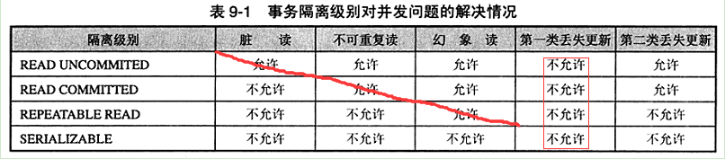并不是所有的数据库都支持事务，即使支持事务的数据库也并非支持所有的事务隔离级别，用户可以通过Connection.getMetaData()方法获取DatabaseMetaData对象，并通过该对象的supportTransactions()、supportsTransactionIsolationLevel(int level)方法查看底层数据库的事务支持情况。

Connection默认情况下是自动提交的，也即每条执行的SQL都对应一个事务，为了能够将多条SQL当成一个事务执行，必须先通过Connection.setAutoCommit(false)阻止自动提交，并通过Connection.setTransactionIsolation()设置事务的隔离级别，还可以通过Connection.rollback()回滚事务。下面的典型的JDBC事务数据操作的代码：

```java
Connection con;
try {
    Class.forName("com.mysql.jdbc.Driver");
    con = DriverManager.getConnection(url,userName,password);
    con.setAutoCommit(false);//关闭自动提交机制
    con.setTransactionIsolation(Connection.TRANSACTION_SERIALIZABLE);//设置事务隔离级别
    Statement stmt = con.createStatement();
    stmt.execute("INSERT INTO t_topic VALUES (1,'tom')");
    con.commit();//提交事务
} catch (Exception e) {
    ...
    con.rollback();//回滚事务
} finally {
    ...
}
```

​	**隔离级别越高，越能保证数据的完整性和一致性，但是对并发性能的影响也越大。对于多数应用程序，可以优先考虑把数据隔离级别设为Read Commited，它能够避免脏读，而且具有较好的并发性能。尽管它会导致不可重复读、虚读和第二类丢失更新这些并发问题，在可能出现这类问题的个别场合，可以由应用程序采用悲观锁或乐观锁来控制。**

## 一个分布式事务场景

​	我们可以设想一个最典型的分布式事务场景：一个跨银行的转账操作设计调用两个异地的银行服务，其中一个是本地银行提供的取款服务，另一个则目标银行提供的存款服务，这两个服务本身是无状态并且是相互独立的，共同构成了一个完整的分布式事务。如果从本地银行取款成功，但是因为某种原因存款服务失败了，那么就必须回滚取款前端状态，否则用户可能会发现自己的钱不翼而飞了。

​	从上面这个例子，我们可以看到，一个分布式事务可以看做是由多个分布式的操作序列组成的，例如上面例子中的取款服务和存款服务，通常可以把这一系列分布式的操作序列称为子事务。因此，分布式事务也可以被定义一种嵌套型的事务，同时也就具有了ACID事务特性。但由于在分布式事务中，各个子事务的执行是分布式的，因此要实现一种能够保证ACID特性的分布式事务处理系统就显得格外负责。

## CAP和BASE理论

​	对于本地事务处理或者是集中式的事务处理系统，很显然我们可以采用已经被实践证明很成熟的ACID模型来保证数据的严格一致性。随着分布式事务的出现，传统的单机事务模型已经无法胜任。尤其是对于一个高访问量、高并发的互联网分布式系统来说，如果我们期望实现一套严格满足ACID特性的分布式事务，很可能出现的情况就是在系统的可用性和严格一致性之间出现冲突，因为当我们要求分布式系统具有严格一致性时，很可能就需要牺牲掉系统的可用性。但毋庸置疑的一点是，可用性又是一个所有消费者不允许我们讨价还价的系统属性，比如说像淘宝网这样的在线购物网站，就要求它能够24小时不间断地对外提供服务，而对于一致性，则更加是所有消费者对于一个软件系统的刚需。因此，在可用性和一致性之间永远无法存在一个两全其美的方案，于是如何构建一个兼顾可用性和一致性的分布式系统成为了无数工程师探讨的难题，出现了诸如CAP和Base这样的分布式系统经典理论。

### CAP理论

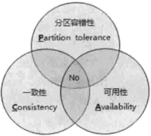

CAP理论：一个分布式系统不可能同时满足一致性（C：Consistency）、可用性（A：Availability）和分区容错性（P：Partition tolerance）这三个基本需求，最多只能同时满足其中的两项。

#### 1.一致性

​	分布式环境中，一致性是指数据在多个副本之间是否能够保持一致的特性。在一致性的需求下，当一个系统在数据一致的状态下执行更新操作后，应该保证系统的数据仍然处于一致的状态。

​	对于一个将数据副本分布在不同分布式节点上的系统来说，如果对第一个节点的数据进行了更新操作并且更新成功后，却没有使得第二节点上的数据得到相应的更新，于是在对第二个节点的数据进行读取操作时，获取的依然是老数据（或称为脏数据），这就是最典型的分布式数据不一致情况。在分布式系统中，如果能够做到针对一个数据项的更新操作执行成功后，所有的用户都可以读取到其最新的值，那么这样的系统就被认为具有强一致性。

#### 2.可用性

​	可用性是指系统提供的服务必须一直处于可用的状态，对于用户的每一个操作请求总是能够在有限时间内返回结果。这里我们重点看下“有限的时间内”和“返回结果”。

​	**“有限的时间内”：**是指，对于用户的一个操作请求，系统必须能够在指定的时间（即相应时间）内返回对应的处理结果，如果超过了这个时间范围，那么系统就被认为是不可用的。另外，“有限的时间内”是一个在系统设计之初就设定好的系统运行指标，通常不同的系统之间会有很大的不同。比如说，对于一个在线搜索引擎来说，通常在0.5秒内需要给出用户检索结果。用户对于一个系统的请求响应时间的期望值不尽相同。但是，无论系统之间的差异有多大，唯一相同的一点就是对于用户请求，系统必须存在一个合理的响应时间，否则用户便会对系统感到失望。

​	**“返回结果”：**是可用性的另一个非常重要的指标，它要求系统在完成对用户请求的处理后，返回一个正常的响应结果。正常的响应结果通常能够明确地反映出对请求的处理结果，即成功或失败，而不是一个让用户感到困惑的返回结果。比如，在线搜索引擎的例子，如果用户输入指定的搜索关键词后，返回的结果是一个系统错误，通常类似于“OutOfMemoryError”等提示语，那么我们认为此时系统是不可用的。

#### 2.分区容错性

​	分区容错性约束了一个分布式系统需要具有如下特性：分布式系统在遇到任何网络分区故障的时候，仍然需要能够保证对外提供满足一致性和可用性的服务，除非是整个网络环境都发生了故障。

​	网络分区是指在分布式系统中，不同的节点分布在不同的子网络（机房或异地网络等）中，由于一些特殊的原因导致这些子网络之间出现网络不连通的状况，但各个子网络的内部网络是正常的，从而导致整个系统的网络环境被切分成了若干个孤立的区域。需要注意的是，组成一个分布式系统的每个节点的加入与退出都可以看作是一个特殊的网络分区。


#### 总结：


​	从CAP定理中我们可以看出，一个分布式系统不可能同时满足一致性、可用性和分区容错性这三个需求。另一方面，需要明确的一点是，对于分布式系统而言，分区容错性可以说是一个最基本的要求。因为既然是一个分布式系统，那么分布式系统中的组件必然需要被部署到不同的节点，否则也就无所谓分布式系统了，因此必然出现子网络。而对于分布式系统而言，网络问题又是一个必定会出现的异常情况，因此分区容错性也就成为了一个分布式系统必然需要面对和解决的问题。因此系统架构设计师往往需要把精力放在如何根据业务特定在C（一致性）和A（可用性）之间寻求平衡。

### Base理论

​	Base是Basically Available（基本可用）、Soft state（软状态）和Eventually consistent（最终一致性）三个短语的简写。Base是对CAP中一致性和可用性权衡的结果，其来源与对大规模互联网系统分布式实践的总结，是基于CAP定理逐步演化而来的，其核心思想是即使无法做到强一致性，但每个应用都可以根据自身的业务特点，采用适当的方式来使系统达到最终一致性。

####Base理论的三要素：

* **基本可用：**基本可用是指分布式系统在出现不可预知故障的时候，允许损失部分可用性，注意，这绝不等价于系统不可用。以下两个就是“基本可用”的典型例子。

* **响应时间上损失：**正常情况下，一个在线搜索引擎需要在0.5秒之内返回给用户响应的查询结果，但由于出现故障（比如系统部分机房发生断电或断网故障），查询结果的响应时间增加1~2秒。

* **功能上的损失**：正常情况下，在一个电子商务网站上进行购物，消费者几乎能够顺利地完成每一笔订单，但是在一些节日大促购物高峰的时候，由于消费者的购物行为激增，为了保护购物系统的稳定性，部分消费者可能会被引导到一个降级页面。

**弱状态**

​	弱状态也成为软状态，是指允许系统的数据存在中间状态，并认为该中间状态的存在不会影响系统的整体可用性，即允许系统在不同节点的数据副本之间进行数据同步的过程存在延时。

**最终一致性**

​	最终一致性强调的是系统中所有的数据副本，在经过一段时间的同步后，最终能够达到一个一致的状态。因此，最终一致性的本质是需要系统保护最终数据能够达到一致，而不需要实时保证系统数据的强一致性。

​	亚马逊首席技术官Werner Vogels在2008年发表的一篇经典文章中，对最终一致性进行了非常详细的介绍。他认为最终一致性是一种特殊的弱一致性：系统能够保证在没有其他新的更新操作的情况下，数据最终一定能够达到一致的状态，因此所有客户端对系统的数据访问都能够获取到最新的值。同时，在没有发生故障的前提下，数据达到一致状态的时间延迟，取决于网络延迟、系统负载和数据复制方案设计等因素。

 

在实际工程实践中，最终一致性存在以下5类主要变种：

**因果一致性（Causal consistency）**

 	因果一致性是指，如果进程A在更新完某个数据项后通知了进程B，那么进程B之后对该数据项的访问都应该能够获取到进程A更新后的最新值，并且如果进程B要对该数据项进行更新操作的话，务必基于进程A更新后的最新值，即不能发生丢失更新情况。与此同时，与进程A无因果关系的进程C的数据访问则没有这样的限制。

**读己之所写（Read your writes）**

​	读己之所写是指，进程A更新一个数据项之后，它自己总是能够访问到更新过的最新值，而不会看到旧值。也就是说，对于单个数据获取者来说，其读取到的数据，一定不会比自己上次写入的值旧。因此，读己之所写也可以看作是一种特殊的因果一致性。

**会话一致性（Session consistency）**

​	会话一致性将对系统数据的访问过程框定在了一个会话当中：系统能保证在同一个有效的会话中实现“读己之所写”的一致性，也就是说，执行更能操作之后，客户端能够在同一个会话中始终读取到该数据项的最新值。

**单调读一致性（Monotonic read consistency）**

​	单调读一致性是指如果一个进程从系统中读取出一个数据项的某个值后，那么系统对于该进程后续的任何数据访问都不应该返回更旧的值。

**单调写一致性（Monotonic write consistency）**

 	单调写一致性是指，一个系统需要能够保证来自同一个进程的写操作被顺序地执行。


以上就是最终一致性的五种常见的变种，在实际系统实践中，可以将其中的若干个变种互相结合起来，以构建一个具有最终一致性特性的分布式系统。事实上，最终一致性并不是只有那些大型分布式系统才涉及的特性，许多现代的关系型数据库都采用了最终一致性模型。在现代关系型数据库中，大多都会采用同步和异步方式来实现主备数据复制技术。在同步方式中，数据的赋值过程通常是更新事务的一部分，因此在事务完成后，主备数据库的数据就会达到一致。而在异步方式中，备库的更新往往会存在延时，这取决于事务日志在主备数据库之间传输的时间长短，如果传输时间过长或者甚至在日志传输过程中出现异常导致无法及时将事务应用到备库上，那么很显然，从备库中读取的数据将是旧的，因此就出现了数据不一致的情况。当然，无论是采用多次重试还是人为数据订正，关系型数据库还是能够保证最终数据达到一致，这就是系统提供最终一致性保证的经典案例。

​	总的来说，Base理论面向的大型高可用可扩展的分布式系统，和传统事务的ACID特性是相反的，它完全不同于ACID的强一致性模型，而是提出通过牺牲强一致性来获得可用性，并允许数据在一段时间内是不一致的，但最终达到一致状态。但同时，在实际的分布式场景中，不同业务单元和组件对数据一致性的要求是不同的，因此在具体的分布式系统架构设计过程中，ACID特性与Base理论往往又会结合在一起使用。

 

# 第二章 分布式一致性协议

 	为了解决分布式一致性问题，在长期的探索研究过程中，涌现出了一大批经典的一致性协议和算法，其中最著名的就二阶段提交协议、三阶段提交协议和Paxos算法。

 	在分布式系统中，每一个机器节点虽然都能够明确地知道自己在进行事务操作过程中的结果是成功或失败，但却无法直接获取到其他分布式节点的操作结果。因此，当一个事务操作需要跨越多个分布式节点的时候，为了保持事务处理的ACID特性，就需要引入一个称为“协调者（Coordinator）”的组件来统一调度所有分布式节点的执行逻辑，这些节点被称为“参与者（Participant）”。协调者负责调度参与者的行为，并最终决定这些参与者是否要把事务真正进行提交。基于这个思想，衍生了2PC和3PC协议。

## 2PC提交协议

​	2PC（Two-Phase Commit，即二阶段提交），为了使基于分布式系统架构下的所有节点在进行事务处理过程中能保持原子性和一致性而设计的一种算法，通常，2PC也被认为是一种一致性协议。目前，绝大部分的关系型数据库都是采用二阶段提交协议来完成分布式事务处理的，利用该协议能够非常方便地完成所有分布式事务参与者的协调，统一决定事务的提交或回滚，从而能够有效地保证分布式数据一致性，因此2PC被广泛引用在许多分布式系统中。

 

2PC将事务的提交过程分成两个阶段：

### 阶段一：提交事务请求

1、协调者发送事务：协调者向所有参与者发送事务内容，询问是否可以执行事务提交操作，并开始等待各参与者的响应；

2、参与者执行事务：各参与者执行事务，并将Undo和Redo信息记入事务日志中

3、反馈事务操作情况：个参与者向协调者反馈事务是否可以执行

### 阶段二：执行事务提交

在阶段二中，协调者会根据各参与者的反馈情况来决定最终是否可以进行事务提交操作，正常情况下，包含以下两种可能。

**执行事务提交：**假如协调者从所有的参与者获得反馈都是Yes，那么就会执行事务提交。

1、协调者向所有参与者发出Commit请求

2、参与者接收到Commit请求，执行事务提交

3、参与者完成事务提交后，向协调者发送Ack消息

4、协调者接收到所有参与者反馈的消息后，完成事务

 

**中断事务：**假如有参与者向协调者反馈No，或者在等待超时之后，协调者尚没有接收到参与者的反馈，那么就中断事务。

1、协调者向所有参与者发出Rollback请求

2、参与者接收到Rollback请求后，会利用阶段一中记录的Undo信息来执行事务回滚

3、反馈事务回滚结果

4、协调者接收到所有参与者反馈的信息后，完成事务中断

 

### 2PC的优缺点

​	简单的地讲，二阶段提交将一个事务的处理过程分为了投票和执行两个阶段，其核心是对每个事务都采用“先尝试，后提交”的处理方式，因此也可以将二阶段提交看作是一个强一致性的算法。

**优点：**原理简单，实现方便

**缺点：**同步阻塞、单点问题、脑裂（网络分区问题）、太过保守

**同步阻塞：**

​	在2PC中，所有的参与该事务操作的逻辑都处于阻塞状态，也就是说，各个参与者在等待其他参与者响应的过程中，将无法进行其他任何操作（就是说参与者在向协调者反馈信息后不能执行其他操作，需要等待其他参与者都反馈完后，然后协调者才能继续执行所有参与者的下一步操作是执行提交还是回滚）。

**单点问题：**

​	一旦协调者出问题，那么整个提交流程将法无法运转

**脑裂（网络分区问题）：**

​	在2PC的第二个阶段时，当协调者向所有的参与者发送Commit请求之后，如果发送了局部网络异常或是协调者在尚未发送完Commit请求之前自身发生了崩溃，那么会导致只有部分参与者收到Commit请求，则会导致整个分布式系统出现数据不一致的现象

**太过保守：**

​	如果参与者出现故障而导致协调者始终无法获取所有参与者的响应信息的话，这时协调者只能依靠自身的超时机制来判断是否需要中断事务，这样的策略显得比较保守。换句话说，2PC没有设计较为完善的容错机制，任意一个节点的失败都会导致整个事务失败

 

## 3PC提交协议

​	3PC（Three-Phase Commit，三阶段提交），是2PC的改进版，其将二阶段提交协议的“提交事务请求”过程一分为二，形成了由CanCommit、PreCommit和doCommit三个阶段组成的事务处理协议。

### 阶段一：CanCommit

​	1、协调者向所有参与者发送一个包括事务内容的CanCommit请求，询问是否可以执行事务提交操作，并开始等待各参与者的响应。

​	2、各参与者向协调者反馈事务询问的响应

### 阶段二：PreCommit

​	在阶段二中，协调者会根据各参与者的反馈情况来决定是否可以进行事务的PreCommit操作，正常情况下，包含两种可能。

**执行事务预提交：**假如协调者从所有参与者获得的都是Yes响应，那么就会执行事务预提交

​	1、协调者向所有参与者发送预提交请求

​	2、参与者接收到PreCommit请求后，会只执行事务，并将Undo和Redo信息记录到事务日志中

​	3、如果参与这个执行事务操作，那么会反馈给协调者Ack响应，同时等待最终指令：提交或回滚

**中断事务：**假如一个参与者向协调者反馈No响应，或者等待超时之后，协调者尚无法接收到所有参与者的反馈，那么就中断事务

​	1、协调者向所有参与者发送中断请求

​	2、无论是收到协调者的中断秋，或是等待协调者请求过程中出现超时，参与者都会中断事务。

### 阶段三：doCommit

​	该阶段将进行真正的事务提交，会存在以下两种可能的情况

**执行提交：**

​	1、协调者向所有参与者发送提交请求

​	2、参与者接收到提交请求后，正式执行事务提交操作，并在完成提交之后释放事务资源

​	3、参与者执行完事务后，向协调者发送Ack消息

​	4、协调者接收到所有参与反馈Ack消息后，完成事务

**中断事务：**

​	1、协调者向所有参与者发送中断请求

​	2、参与者接收到中断请求后，会利用阶段二记录的Undo信息来执行事务回滚操作，并在完成回滚后释放事务资源

​	3、参与者在完成事务回滚后，向协调发送Ack消息

​	4、协调者接收到所有参与者反馈的Ack消息后，中断事务

注意：一旦进入阶段三，可能会存在以下两种故障

* 协调者出现问题

* 协调者和参与者之间的网络出现故障

无论出现哪种情况，最终都会导致参与者无法及时接收到来自协调者的doCommit或是中断请求，针对这样的异常情况，参与者都会在等待超时之后，继续进行事务提交。

 

### 3PC的优缺点

**优点：**相较于二阶段提交协议，三阶段提交协议最大的优点就是降低了参与者的阻塞范围，并能够在出现单点故障后继续达成一致。

**缺点：**3PC在去除阻塞的同时也引入了新的问题，那就是在参与者接收到preCommit消息后，如果网络出现分区，此时协调者所在的节点和参与者无法进行正常的网络通信，在这种情况下，该参与者依然会进行事务的提交，这必然出现数据的不一致性。

## Paxos算法（太难了。。。）

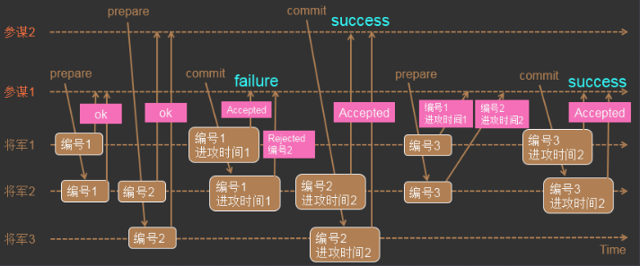

## 小结

​	2PC解决了分布式事务的原子性问题，保证了分布式事务的多个参与者要么都执行成功，要么都执行失败。但是，2PC存在一些难易解决的诸如同步阻塞、无限期等待和脑裂（网络分区）等问题。

​	**3PC在2PC的基础上添加了PreCommit过程，从而避免了2PC无限期等待问题，在3PC的CanCommit过程中如果出现网络故障，导致超时，这时候就会中断事务，而不像2PC中需要各个参与者都执行完事务（还没提交）后才能知道是否需要中断，这样就降低了参与者的阻塞范围。另外，虽然2PC和3PC都可能导致出现数据不一致的问题，但是在3PC中，多增加了一层CanCommit校验，这样网络故障或节点故障发生的时候就能在CanCommit中被发现，而不是等到DoCommit阶段才被发现，从概率上3PC可以减少这种数据不一致性的问题发生。**

​	**Paxos引入了“过半（及少数服从多数）”的理论，同时，Paxos算法支持分布式节点角色之间的轮换，这极大地避免了分布式单点问题的出现**，因此Paxos即解决了无限期等待问题，也解决了脑裂（网络分区）问题，是目前来说最优秀的分布式一致性协议之一。


# 第四章 ZooKeeper与Paxos

##Zookeeper是什么

​		ZooKeeper为分布式应用提供了高效且可靠的分布式协调服务，提供了诸如统一命名服务、配置管理和分布式锁等分布式的基础服务。在解决分布式数据一致性方面，ZooKeeper没有直接采用Paxos算法，而是采用ZAB（ZooKeeper Atomic Broadcast）协议。

​		ZooKeeper是一个典型的分布式数据一致性的解决方案，分布式应用程序可以基于它实现诸如数据发布/订阅、负载均衡、命名服务、分布式协调/通知、集群管理、Master选举、分布式锁和分布式队列等功能。

**ZooKeeper可以保证如下分布式一致性特性：**

* **顺序一致性：**客户端发起的事务请求，都会按照发起顺序被应用到ZooKeeper中去

* **原子性：**所有事务请求要么成功应用到整个集群中所有机器上的，要么都没有执行事务请求

* **单一视图：**集群机器都是一样，无论客户端连接哪台服务器，服务端数据模型都是一致的

* **可靠性：**服务端成功应用一个事务后，该事务引起的服务端状态变更会被一直保留下来，除非有另一个事务对其进行变更

* **实时性：**ZooKeeper能保证在一定的时间段内，客户端最终一定能够从服务端读取到最新的数据状态，这里可以理解为最终一致性。

##ZooKeeper的设计目标

* **目标一：简单的数据模型**：Zookeeper使得分布式程序能够通过一个共享的、树型结构的名字空间来进行相互协调。这里所有的树型结构的名字空间，是指Zookeeper服务器内存中的一个数据模型，其由一系列被称为ZNode的数据节点组成，总的来说，其数据模型类似于一个文件系统，而ZNode的数据节点组成，总的来说，其数据模型类似于一个文件系统，而ZNode之间的层级关系，就像文件系统的目录结构一样。不过和传统的磁盘文件系统不同的是，Zookeeper将全量数据存储在内存中，一次来实现提供服务器吞吐、减少延迟的目的。

* **目标二：可以构建集群**

​	一个Zookeeper集群通常由一组机器组成，一般3~5台机器就可以组成一个可用的Zookeeper机器了，如下图：


​		组成Zookeeper集群的每台机器都会在内存中维护当前的服务器状态，并且每台机器之间都相互保持着通信。值得一提的是，只要集群中存在超过一半的机器能够正常工作，那么整个集群就能正常对外服务。

​		Zookeeper的客户端程序会选择和集群中任意一台机器共同来创建一个TCP连接，而一旦客户端和某台Zookeeper服务器之间的连接断开后，客户端会自动连接到集群中的其他机器。

* **目标三：顺序访问**

​		对于来自客户端的每个更新请求，Zookeeper都会分配一个全局唯一的递增编号，这个编号反映了所有事务操作的先后顺序，应用程序可以使用Zookeeper的这个特性来实现更高层次的同步原语。

* **目标四：高性能**

​		由于Zookeeper将全量数据存储在内存中，并直接服务于客户端的所有非事务请求，因此它尤其适用于以读操作为主的应用场景。作者曾经以3台3.4.3版本的Zookeeper服务器组成集群进行性能压测，100%读请求的场景下压测结果是12~13W的QPS。

 

## ZooKeeper基本概念

### 集群角色

​		通常在分布式系统中，在典型的集群模式是Master/Slave模式（主备模式）。在这种模式中，我们把能够处理所有写操作的机器称为Master机器，把所有通过异步复制方式获取最新数据，并提供读服务的机器称为Slave机器。在ZooKeeper中，没有沿用传统的Master/Slave概念，而是引入了Leader、Follower和Observer三种角色。

**Leader：**ZooKeeper集群中的所有机器通过一个Leader选举过程来选定一台被称为“Leader”的机器，Leader服务器为客户端提供读和写服务。

**Follower和Observer：**Follower和Observer都能够提供读服务，唯一的区别在于，Observer机器不参与Leader选举过程，也不参与写操作的“过半写成功”策略，因此Observer可以在不影响写性能的情况下提升集群的度性能。

### 会话

​		Session是指客户端会话，在了解会话前，我们先了解下客户端连接。**在ZooKeeper中，一个客户端连接是指客户端和服务器之间的一个TCP长连接**。ZooKeeper对外的服务端口默认是2181，客户端启动的时候，首先会与服务器建立一个TCP连接，从第一次连接建立开始，客户端会话的生命周期也开始了，通过这个连接，客户端能够通过心跳检测与服务器保持有效的会话，也能够向ZooKeeper服务器发送请求并接受响应，同时还能够通过该连接接收来自服务器的Watch事件通知。

```
有个疑问：为什么zk使用长连接
```

​		Session的sessionTimeout值用来设置一个客户端会话的超时时间。当由于服务器压力太大、网络故障或是客户端主动断开连接等各种原因导致客户端连接断开，只要在sessionTimeout规定时间内能够重新连接上集群中任意一台服务器，那么之前创建的会话仍然有效。

### 数据节点

​		“节点”是指集群中的每一台机器。在ZooKeeper中，“节点”分为两类，第一类同样是构成集群的机器，我们成为机器节点；第二类是指数据模型中的数据单元，我们称之为数据节点（ZNode）。

​		ZooKeeper将所有数据存储在内存中，数据模型是一棵树，由斜杠（/）进行分割的路径，就是一个ZNode，例如/foo/path1。每个ZNode上都会保存自己的数据内容，同时还会保存一系列属性信息。

**ZNode又可以分为持久节点和临时节点两类：**

* 持久节点：所谓持久节点是指一旦这个ZNode被创建了，除非主动进行ZNode的移除操作，否则这个ZNode将一直保存在ZooKeeper上。

* 临时节点：临时节点的生命周期和客户单会话绑定，一旦客户端会话失效，那么这个客户端创建的所有的临时节点都会被移除。

另外，ZooKeeper还允许用户为每个节点添加一个特殊的属性：Sequential。一旦节点被标记上这个属性，那么在这个节点被创建的时候，ZooKeeper会自动在其节点名后面追加上一个整形数字，这个整形数字是一个由父节点维护的自增数字。

**7种ZNode类型**

* **PERSISTENT**：持久节点：当客户端断开连接时，znode将不会被自动删除
* **PERSISTENT_SEQUENTIAL**：持久有序：当客户端断开连接时，znode将不会被自动删除，并且节点的名称将在后面追加一个递增的数字
* **EPHEMERAL**：临时节点：当客户端断开连接时，znode将被删除
* **EPHEMERAL_SEQUENTIAL**：临时有序的节点：当客户端断开连接时，znode将被删除，并且节点的名称将在后面追加一个递增的数字
* **CONTAINER**：容器节点：如果节点中最后一个子Znode被删除，将会触发删除该Znode。容器节点是一种特殊用途的节点，对诸如leader、lock等非常有用。
* **PERSISTENT_WITH_TTL**：客户端断开连接后不会自动删除 Znode，如果该 Znode 没有子 Znode 且在给定 TTL 时间内无修改，该 Znode 将会被删除；TTL 单位是毫秒，必须大于0 且小于或等于 EphemeralType.MAX_TTL
* **PERSISTENT_SEQUENTIAL_WITH_TTL**：客户端断开连接后不会自动删除 Znode，如果该 Znode 没有子 Znode 且在给定 TTL 时间内无修改，该 Znode 将会被删除；TTL 单位是毫秒，必须大于0 且小于或等于 EphemeralType.MAX_TTL。与{@link #PERSISTENT_WITH_TTL} 的区别是，该类型是有序的

    Zookeeper TTL机制：
    
    键值系统有一个对应用配置很有帮助的特性，可以给每一个键或目录指定一个存活时限（TTL，即Time To Life）。TTL的单位是秒，当指定的秒数过去以后，如果相应的键或目录没有得到更新，就会被自动从Etcd记录中移除。
    
    在zookeeper中，当你创建一个PERSISTENT或者PERSISTENT_SEQUENTIAL的节点的时候，可以有选择性给这个节点设置一个毫秒的TTL时间，如果这个节点在ttl时间之内没有得到更新并且没有孩子节点，这个节点就会在server端被删除掉。


### 版本

​		对于ZNode，ZooKeeper都会为其维护一个叫作Stat的数据结构，Stat中记录了这个ZNode的三个数据版本，分别是version（当前ZNode的版本）、cversion（当前ZNode子节点的版本）和aversion（当前ZNode的ACL版本）。

Stat类源码如下：

```java
public class Stat implements Record {
    /** 创建znode更改的事务ID */
    private long czxid;
    /** 最后修改znode的事务ID */
    private long mzxid;
    /** znode创建时间 */
    private long ctime;
    /** znode最后修改时间 */
    private long mtime;
    /** 这表示对znode节点进行的更改次数 */
    private int version;
    /** 这表示对此znode的子节点进行的更改次数 */
    private int cversion;
    /** 表示对此znode的ACL进行更改的次数 */
    private int aversion;
    /** 如果znode是ephemeral类型节点，则这是znode所有者的 session ID。 如果znode不是ephemeral节点，则该字段设置为零。 */
    private long ephemeralOwner;
    /** 表示znode数据字段的长度 */
    private int dataLength;
    /** 表示znode的子节点的数量 */
    private int numChildren;
    /** 表示给znode添加或删除子节点的事务ID */
    private long pzxid;
    
    // 省略 getter and setter ...
}
```

### Watcher

​		Watcher（事件监听器），是ZooKeeper中的一个很重要的特性。ZooKeeper允许用户在指定节点上注册一些Watcher，并且在一些特定事件触发的时候，ZooKeeper服务端会将事件通知到感兴趣的客户端上去，该机制是ZooKeeper实现分布式协调服务的重要特性。

### ACL

​		首先什么是ACL呢？ACL全称为Access Control List 即访问控制列表，用于控制资源的访问权限。zookeeper利用ACL策略控制节点的访问权限，如节点数据读写、节点创建、节点删除、读取子节点列表、设置节点权限等。

在传统的文件系统中，ACL分为两个维度，一个是属组，一个是权限，一个属组包含多个权限，一个文件或目录拥有某个组的权限即拥有了组里的所有权限，文件或子目录默认会继承自父目录的ACL。而在Zookeeper中，znode的ACL是没有继承关系的，每个znode的权限都是独立控制的，只有客户端满足znode设置的权限要求时，才能完成相应的操作。Zookeeper的ACL，分为三个维度：scheme、id、permission，通常使用：

```
scheme:id:permission
```

来标识一个有效的ACL信息。

其中，scheme代表授权策略，id代表用户，permission代表权限。下面从这三个维度分别来介绍。

* **scheme**：scheme对应于采用哪种方案来进行权限管理，zookeeper的scheme的分类如下：
  * world：它下面只有一个id, 叫anyone, world:anyone代表任何人，zookeeper中对所有人有权限的结点就是属于world:anyone的
  * auth：它不需要id, 只要是通过authentication的user都有权限（zookeeper支持通过kerberos来进行authencation, 也支持username/password形式的authentication)
  * digest：是最常用的权限控制模式，也更符合我们对权限控制的认识，其类似于"username:password"形式的权限标识进行权限配置。它对应的id为username:BASE64(SHA1(password))，即对密码先做SHA1加密然后再进行BASE64摘要。

* **IP**：它对应的id为客户机的IP地址，设置的时候可以设置一个ip段，比如ip:192.168.1.0/16, 表示匹配前16个bit的IP段，也可以设置为某一个具体的ip
  super: 在这种scheme情况下，对应的id拥有超级权限，可以做任何事情(cdrwa)
  其实这几种scheme中最常用的也就是world，digest和ip，其他的都很少使用，了解一下就行了。

* **ID**：id是验证模式，不同的scheme，id的值也不一样。scheme为ip时，id的值为客户端的ip地址。scheme为world时，id的值为anyone。scheme为digest时，id的值为：username:BASE64(SHA1(password))。

* **permission**：zookeeper目前支持下面一些权限：
  * CREATE(c): 创建权限，可以在在当前node下创建child node，即对子节点Create操作
  * DELETE(d): 删除权限，可以删除当前的node，即对子节点Delete操作
  * READ(r): 读权限，可以获取当前node的数据，可以list当前node所有的child nodes，即对本节点GetChildren和GetData操作
  * WRITE(w): 写权限，可以向当前node写数据，即对本节点SetData操作
  * ADMIN(a): 管理权限，可以设置当前node的permission，即对本节点setAcl操作

注意：create和delete这两种权限都是针对子节点的权限控制。


## ZAB协议（太难了。。。）

 

 

## ZAB与Paxos的区别

 **两者的联系**

* 两者都存在一个类似于Leader进程的角色，由其负责协调多个Follower进程的运行

* Leader进程都会等待超过半数的Follower作出正确的反馈后，才会将一个提案进行提交。

* 在ZAB协议中，每个Proposal中都包含一个epoch值，用来代表当前的Leader周期，在Paxos算法中，同样存在这样一个标识，只是名字变成了Ballot。


​	在Paxos算法中，一个新选举产生的主进程进行两个阶段的工作。第一阶段被称为读阶段，在这个阶段中，这个新的主进程会通过和所有其他进程进行通信的方式来收集上一个主进程提出的提案，并将它们提交。第二阶段被称为写阶段，在这个阶段，当前主进程开始提出它自己的提案。

​	在Paxos算法的基础上，ZAB协议额外添加了一个同步阶段。在同步阶段之前，ZAB协议也存在一个和Paxos算法中的读阶段非常类似的过程，称为发现（Discover）阶段。在同步阶段中，新的Leader会确保在过半的Follower已经提交了之前Leader周期中的所有事务Proposal。这一同步阶段的引入，能够有效地保证Leader在新的周期中的所有事务Proposal。这一同步阶段的引入，能够有效地保证Leader在新的周期中提出事务Proposal之前，所有的进程都已经完成了对之前所有事务Proposal的提交。一旦完成同步阶段后，那么ZAB就会执行和Paxos算法类似的写阶段。

​	总的来将，ZAB协议和Paxos算法的本质区别在于，两者的设计目标不太一样。ZAB协议主要用于构建一个高可用的分布式数据主备系统，例如ZooKeeper，而Paxos算法则是用于构建一个分布式的一致性状态机系统。

# 第五章 zookeeper教程

​	Zookeeper运行模式有三种：单机模式、集群模式和伪集群模式，三种模式差别不大，以下会进行介绍，这里以单机模式为例。Zookeeper使用Java语言编写，运行环境需要Java环境的支持，安装前请先安装1.6及以上版本的JDK，然后到http://mirrors.hust.edu.cn/apache/zookeeper/zookeeper-3.4.6/下载zookeeper安装包zookeeper-3.4.6.tar.gz，这里使用3.4.6版本。注意下载的是部署包，不是源码包，否则启动时会报如下错误：Error: Could not find or load main class org.apache.zookeeper.server.quorum.QuorumPeerMain

 

 

## 单机模式

### 1、上传ZooKeeper部署包并解压

​	将zookeeper-3.4.6.tar.gz上传至/opt目录，我们将zookeeper安装在该目录下，cd到该目录下，使用tar -zxvf zookeeper-3.4.6.tar.gz进行解压，生成如下文件


 

### 2、配置zoo.cfg

在confg目录下创建zoo.cfg，并配置如下内容：

```properties
tickTime=2000
dataDir=/var/lib/zookeeper/
clientPort=2181
initLimit=5
syncLimit=2
server.1=192.168.85.128:2888:3888
```

### 3、配置myid文件

​	在/var/lib/zookeeper/目录下创建myid文件并在该文件的第一行写上一个数字1。

### 4、启动ZooKeeper并验证

​	使用sh zkServer.sh start或（./zkServer.sh start）命令进行启动Zookeeper，可以使用三种方式来验证Zookeeper是否正常启动，如：

```bash
[root@localhost bin]# ./zkServer.sh start
JMX enabled by default
Using config: /opt/zookeeper-3.4.6/bin/../conf/zoo.cfg
Starting zookeeper ... STARTED
[root@localhost bin]# ./zkServer.sh status
JMX enabled by default
Using config: /opt/zookeeper-3.4.6/bin/../conf/zoo.cfg
Mode: standalone
[root@localhost bin]# telnet 192.168.85.128 2181
Trying 192.168.85.128...
Connected to 192.168.85.128.
Escape character is '^]'.
stat
Zookeeper version: 3.4.6-1569965, built on 02/20/2014 09:09 GMT
Clients:
 /192.168.85.128:44159[0](queued=0,recved=1,sent=0)
Latency min/avg/max: 0/0/0
Received: 2
Sent: 1
Connections: 1
Outstanding: 0
Zxid: 0x0
Mode: standalone
Node count: 4
Connection closed by foreign host.
[root@localhost bin]# echo ruok | nc 192.168.85.128 2181
imok
```

使用telnet和nc命令验证是否启动成功时需要安装telnet和nc才行，否则会提示找不到命令。另外，启动完后会在bin目录下生成一个zookeeper.out日志文件，如果没有正常启动，可以来查看这个文件，如果要修改这个文件输出位置，请查看“zookeeper log4j日志输出修改”教程。

 

### 5、停止ZooKeeper

使用sh zkServer.sh stop停止ZooKeeper服务

```bash
[root@localhost bin]# sh zkServer.sh stop
JMX enabled by default
Using config: /opt/zookeeper-3.4.6/bin/../conf/zoo.cfg
Stopping zookeeper ... STOPPED
```

## 集群模式

按照以上单机模式的步骤，为其他集群机器配置上zoo.cfg和myid文件即可，zoo.cfg文件修改如下：

```properties
tickTime=2000
dataDir=/var/lib/zookeeper/
clientPort=2181
initLimit=5
syncLimit=2
server.1=192.168.85.127:2888:3888
server.2=192.168.85.128:2888:3888
server.3=192.168.85.129:2888:3888
```

集群中所有机器的zoo.cfg文件的内容都应该是一致的。因此最好使用SVN或是GIT把此文件管理起来，确保每个机器都能共享到一份相同的配置。

 

## 伪集群模式

​	伪集群是指所有的集群都在同一台机器上，但是还是以集群的特性来对外提供服务。这种模式和集群模式类似，只需修改zoo.cfg配置，如：

```properties
tickTime=2000
dataDir=/var/lib/zookeeper/
clientPort=2181
initLimit=5
syncLimit=2
server.1=192.168.85.127:2888:3888
server.2=192.168.85.128:2889:3889
server.3=192.168.85.128:2890:3890
```

## [Zookeeper Log4j日志输出修改](http://yangyoupeng-cn-fujitsu-com.iteye.com/blog/1922459)

1、修改log4j.properties：

```bash
 %ZK_HOME%conf/log4j.properties
将：zookeeper.root.logger=INFO, CONSOLE  
改成： zookeeper.root.logger=INFO,ROLLINGFILE 
```

 2、修改bin/zkEvn.sh文件：

```bash
将：
if [ "x${ZOO_LOG4J_PROP}" = "x" ]  
then  
	ZOO_LOG4J_PROP="INFO,CONSOLE"  
fi  
 改成：
if [ "x${ZOO_LOG4J_PROP}" = "x" ]  
then  
	ZOO_LOG4J_PROP="INFO,ROLLINGFILE"  
fi 

将：
if [ "x${ZOO_LOG_DIR}" = "x" ]
then
	ZOO_LOG_DIR="."
fi
改成：
if [ "x${ZOO_LOG_DIR}" = "x" ]
then
	ZOO_LOG_DIR="/opt/zookeeper-3.4.6/logs"
fi
```


这样再启动zkSever.sh start的时候 就会生成在/opt/zookeeper-3.4.6/logs目录中生成日志了

 

## zookeeper客户端脚本

### 1、启动ZooKeeper客户端

进入ZooKeeper的bin目录之后，执行如下命令：

```shell
sh zkCli.sh
```

当看到如下输出信息时，表示已经成功连接上本地的ZooKeeper服务器了：


注意，上面的命令没有显示地指定ZooKeeper服务器地址，那么默认是连接本地的ZooKeeper服务器。如果希望连接指定的ZooKeeper服务器，可以通过如下方式实现：

```shell
sh zkCli.sh -server [ip]:[port]
```


### 2、创建节点

使用如下命令可以创建一个ZooKeeper节点：

```shell
create [-s] [-e] path data acl
```

其中，-s或-e分别指定节点特性：顺序或临时节点。默认情况下，即不添加-s或-e参数的，创建的是持久节点。create命令的最后一个参数是acl，它是用来进行权限控制的，缺省情况下，不做任何权限控制。

**示例：**

```shell
[zk: localhost:2181(CONNECTED) 0] create /zk-book 123
Created /zk-book
```

执行完上面的命令，就在ZooKeeper的根节点下创建了一个叫作/zk-book的节点，并且节点的数据内容是“123”。

### 3、读取子节点

使用ls命令，可以列出ZooKeeper节点下的所有子节点。注意：这个命令只能看到指定节点下第一级的所有子节点。语法如下：

```shell
ls path [watch]
```

其中，path表示的是指定数据节点的路径，第一次部署的ZooKeeper集群，默认在根节点“/”下面有一个叫作/zookeeper的保留节点。

示例：

```shell
[zk: localhost:2181(CONNECTED) 1] ls /
[zk-book, zookeeper]
```

### 4、读取节点数据

使用get命令，可以获取ZooKeeper指定节点的数据内容和属性信息。用法如下：

```sh
[zk: localhost:2181(CONNECTED) 2] get /zk-book
123
cZxid = 0x2
ctime = Sat Apr 08 07:06:05 PDT 2017
mZxid = 0x2
mtime = Sat Apr 08 07:06:05 PDT 2017
pZxid = 0x2
cversion = 0
dataVersion = 0
aclVersion = 0
ephemeralOwner = 0x0
dataLength = 3
numChildren = 0
```

从上面的输出信息中，我们可以看到，第一行是节点/zk-book的数据内容，其他几行则是创建该节点的事务ID（cZxid）、最后一次更新该节点的事务ID（mZxid）和最后一次更新该节点的时间（mtime）等属性。

### 5、更新节点数据内容

使用set命令，可以更新指定节点的数据内容，用法如下：set path [version]

其中，data就是更新的新内容。注意，set命令后面还有一个version参数，在ZooKeeper中，节点的数据是有版本概念的，这个参数用于指定本次更新操作是基于ZNode的哪一个数据版本进行的。

**示例：**

```sh
[zk: localhost:2181(CONNECTED) 3] set /zk-book 456
cZxid = 0x2
ctime = Sat Apr 08 07:06:05 PDT 2017
mZxid = 0x3
mtime = Sat Apr 08 07:08:35 PDT 2017
pZxid = 0x2
cversion = 0
dataVersion = 1
aclVersion = 0
ephemeralOwner = 0x0
dataLength = 3
numChildren = 0
```

执行以上命名后，节点/zk-book的数据内容就已经被更新成“456”了。另外在输出信息中，dataVersion的值有原来的0变成了1，这是因为刚才的更新操作导致该节点的数据版本也发生了变更。

### 5、删除节点

使用delete命令，可以删除ZooKeeper上的指定节点，用法如下：

delete path [version]

次命令中的version参数和set命令中的version参数的作用是一致的。


### 完整示例

```bash
[root@localhost bin]# sh zkCli.sh
Connecting to localhost:2181

2017-04-08 04:37:22,748 [myid:] - INFO  [main:Environment@100] - Client environment:zookeeper.version=3.4.6-1569965, built on 02/20/2014 09:09 GMT

2017-04-08 04:37:22,753 [myid:] - INFO  [main:Environment@100] - Client environment:host.name=localhost

2017-04-08 04:37:22,754 [myid:] - INFO  [main:Environment@100] - Client environment:java.version=1.7.0_79

2017-04-08 04:37:22,758 [myid:] - INFO  [main:Environment@100] - Client environment:java.vendor=Oracle Corporation

2017-04-08 04:37:22,758 [myid:] - INFO  [main:Environment@100] - Client environment:java.home=/opt/java/jdk1.7.0_79/jre

2017-04-08 04:37:22,758 [myid:] - INFO  [main:Environment@100] - Client environment:java.class.path=/opt/zookeeper-3.4.6/bin/../build/classes:/opt/zookeeper-3.4.6/bin/../build/lib/*.jar:/opt/zookeeper-3.4.6/bin/../lib/slf4j-log4j12-1.6.1.jar:/opt/zookeeper-3.4.6/bin/../lib/slf4j-api-1.6.1.jar:/opt/zookeeper-3.4.6/bin/../lib/netty-3.7.0.Final.jar:/opt/zookeeper-3.4.6/bin/../lib/log4j-1.2.16.jar:/opt/zookeeper-3.4.6/bin/../lib/jline-0.9.94.jar:/opt/zookeeper-3.4.6/bin/../zookeeper-3.4.6.jar:/opt/zookeeper-3.4.6/bin/../src/java/lib/*.jar:/opt/zookeeper-3.4.6/bin/../conf:.:/opt/java/jdk1.7.0_79/lib/dt.jar:/opt/java/jdk1.7.0_79/lib/tools.jar

2017-04-08 04:37:22,758 [myid:] - INFO  [main:Environment@100] - Client environment:java.library.path=/usr/java/packages/lib/amd64:/usr/lib64:/lib64:/lib:/usr/lib

2017-04-08 04:37:22,759 [myid:] - INFO  [main:Environment@100] - Client environment:java.io.tmpdir=/tmp

2017-04-08 04:37:22,759 [myid:] - INFO  [main:Environment@100] - Client environment:java.compiler=<NA>

2017-04-08 04:37:22,759 [myid:] - INFO  [main:Environment@100] - Client environment:os.name=Linux

2017-04-08 04:37:22,759 [myid:] - INFO  [main:Environment@100] - Client environment:os.arch=amd64

2017-04-08 04:37:22,759 [myid:] - INFO  [main:Environment@100] - Client environment:os.version=2.6.32-431.el6.x86_64

2017-04-08 04:37:22,760 [myid:] - INFO  [main:Environment@100] - Client environment:user.name=root

2017-04-08 04:37:22,760 [myid:] - INFO  [main:Environment@100] - Client environment:user.home=/root

2017-04-08 04:37:22,760 [myid:] - INFO  [main:Environment@100] - Client environment:user.dir=/opt/zookeeper-3.4.6/bin

2017-04-08 04:37:22,763 [myid:] - INFO  [main:ZooKeeper@438] - Initiating client connection, connectString=localhost:2181 sessionTimeout=30000 watcher=org.apache.zookeeper.ZooKeeperMain$MyWatcher@2897eb44

Welcome to ZooKeeper!

2017-04-08 04:37:23,119 [myid:] - INFO  [main-SendThread(localhost:2181):ClientCnxn$SendThread@975] - Opening socket connection to server localhost/0:0:0:0:0:0:0:1:2181. Will not attempt to authenticate using SASL (unknown error)

2017-04-08 04:37:23,145 [myid:] - INFO  [main-SendThread(localhost:2181):ClientCnxn$SendThread@852] - Socket connection established to localhost/0:0:0:0:0:0:0:1:2181, initiating session

JLine support is enabled

2017-04-08 04:37:23,298 [myid:] - INFO  [main-SendThread(localhost:2181):ClientCnxn$SendThread@1235] - Session establishment complete on server localhost/0:0:0:0:0:0:0:1:2181, sessionid = 0x15b4d3461d10000, negotiated timeout = 30000

WATCHER::

WatchedEvent state:SyncConnected type:None path:null
[zk: localhost:2181(CONNECTED) 0] create /zk-book 123
Created /zk-book
[zk: localhost:2181(CONNECTED) 1] ls /
[zk-book, zookeeper]
[zk: localhost:2181(CONNECTED) 2] get /zk-book
123
cZxid = 0x2
ctime = Sat Apr 08 07:06:05 PDT 2017
mZxid = 0x2
mtime = Sat Apr 08 07:06:05 PDT 2017
pZxid = 0x2
cversion = 0
dataVersion = 0
aclVersion = 0
ephemeralOwner = 0x0
dataLength = 3
numChildren = 0
[zk: localhost:2181(CONNECTED) 3] set /zk-book 456
cZxid = 0x2
ctime = Sat Apr 08 07:06:05 PDT 2017
mZxid = 0x3
mtime = Sat Apr 08 07:08:35 PDT 2017
pZxid = 0x2
cversion = 0
dataVersion = 1
aclVersion = 0
ephemeralOwner = 0x0
dataLength = 3
numChildren = 0
[zk: localhost:2181(CONNECTED) 4] delete /zk-book
[zk: localhost:2181(CONNECTED) 5] ls /
[zookeeper]
[zk: localhost:2181(CONNECTED) 6]
```


## Java客户端API

### 1、创建会话

客户端可以通过创建ZooKeeper实例来连接ZooKeeper服务器，ZooKeeper的4中构造器如下：

```java
public ZooKeeper(String connectString, int sessionTimeout, Watcher watcher) throws IOException

public ZooKeeper(String connectString, int sessionTimeout, Watcher watcher, boolean canBeReadOnly) throws IOException

public ZooKeeper(String connectString, int sessionTimeout, Watcher watcher, long sessionId, byte[] sessionPasswd) throws IOException

public ZooKeeper(String connectString, int sessionTimeout, Watcher watcher, long sessionId, byte[] sessionPasswd, boolean canBeReadOnly) throws IOException 
```

 

使用任意一个构造方法都可以顺利完成与ZooKeeper服务器的会话创建，以下是对每个参数的说明：

| **参数名**              | **说明**                                                     |
| ----------------------- | ------------------------------------------------------------ |
| connectString           | 指ZooKeeper服务器列表，由英文状态逗号分开的host:post字符串组成，每一个都代表一台ZooKeeper机器，例如，192.168.1.1:2181，192.168.1.2:2181,192.168.1.3:2181,这样就为客户端指定了三台服务器地址。另外，也可以在connectString中设置客户端连接上ZooKeeper后的根目录，方法是在host:host字符串之后添加上这个根目录，例如，192.168.1.1:2181,192.168.1.2:2181,192.168.1.3:2181/zk-book，这样就指定了该客户端连接上ZooKeeper服务器之后，所有对ZooKeeper的操作，都会基于这个根目录。例如，客户端对/foo/bar的操作，都会指向节点的操作，都会基于这个根目录，例如，客户端对/foo/bar的操作，都会指向节点/zk-book/foo/bar——这个目录也叫Chroot，即客户端隔离命名空间。 |
| sessionTimeout          | 指会话的超时时间，是一个以“毫秒”为单位的整型值。在ZooKeeper中有会话的概念，在一个会话周期内，ZooKeeper客户端和服务器之间会通过心跳检测机制来维持会话的有效性，一旦在sessionTimeout时间内没有进行有效地心跳检测，会话就会失效。 |
| watcher                 | ZooKeeper允许客户端在构造方法中传入一个接口Watcher(org.apache.zookeeper.Watcher)的实现类对象来作为默认的Watcher事件通知处理器。当然，该参数可以设置为null以表明不需要设置默认的Watcher处理器。 |
| canBeReadOnly           | 这是一个boolean类型的参数，用于标识当前会话是否支持“read-only（只读）”模式。默认情况下，在ZooKeeper集群中，一个机器如果和集群中过半及以上机器失去了网络连接，那么这个机器将不再处理客户端请求（包括读写请求）。但是在某些使用场景下，当ZooKeeper服务器发生此类故障的时候，我们还是希望ZooKeeper服务器能够提供读服务（当然写服务肯定无法提供）——这就是ZooKeeper的“read-only”模式。 |
| sessionId和sessionPaswd | 分别代表会话ID和会话秘钥。这两个参数能够唯一确定一个会话，同时客户端使用这两个参数可以实现客户端会话复用，从而达到恢复会话的效果。具体使用方法是，第一次连接上ZooKeeper服务器时，通过调用ZooKeeper对象实例的以下两个接口，即可获得当前会话的ID和密钥：    long getSessionId();    byte[] getSessionPasswd();    获取到这两个参数值之后，就可以在下次创建ZooKeeper对象实例的时候传入构造方法了。 |

 	注意，ZooKeeper客户端和服务端会话的建立是一个异步的过程，也就是说在程序中，构造方法会在处理完客户端初始化工作后立即返回，在大多数情况下，此时并没有真正建立好一个可用的会话，在会话的生命周期中处于“CONNECTION”的状态。

​	当该会话真正创建完毕后，ZooKeeper服务端会向会话对应的客户端发送一个事件通知，以告知客户端，客户端只有在获取这个通知之后，才算真正建立了会话。

​	该构造方法内部实现了与ZooKeeper服务器之间的TCP连接创建，负责维护客户端会话的生命周期。

### 2、创建节点

客户端可以通过ZooKeeper的API来创建一个数据节点，有如下两个接口：

```java
public String create(String path, byte[] data, List<ACL> acl, CreateMode createMode) throws KeeperException, InterruptedException

public void create(String path, byte[] data, List<ACL> acl, CreateMode createMode, StringCallback cb, Object ctx) 
```

这两个接口分别以同步和异步方式创建节点，API方法的参数说明如下：


​	需要注意的是，无论同步还是异步接口，ZooKeeper都不支持递归创建，即无法再父节点不存在的情况下创建一个子节点。另外，如果一个节点已经存在了，那么创建同名节点的时候，会抛出NodeExistsException异常。

​	目前，ZooKeeper的节点内容只支持字节数组（byte[]）类型，也就是说，ZooKeeper不负责为节点内容进行序列化，开发人员需要自己使用序列化工具将节点内容进行序列化和反序列化。对于字符串，可以简单地使用”string”.getBytes()来生成一个字节数组；对于其他复杂对象，可以使用Hessian或是Kryo等专门的序列化工具来进行序列化。

​	关于权限控制，如果应用场景没有太高的权限要求，那么可以不关注这个参数，只需要在acl参数中传入参数Ids.OPEN_ACL_UNSAFE，这就表明之后对这个节点的任何操作都不受权限控制。

**使用异步接口创建节点：**

​	使用异步方式创建时，用户需要实现AsynCallback.StringCallback()接口即可。AsynCallback包含了StatCallback、DataCallback、ACLCallback、ChildrenCallback、Children2Callback、StringCallback和VoidCallback七种不同的回调接口，用户可以在不同的异步接口中实现不同的接口。

​	和同步接口方法最大的区别在于，节点的创建过程（包括网络通信和服务端的节点创建过程）是异步的。并且，在同步接口调用过程中，我们需要关注接口抛出异常的可能；但是在异步接口中，接口本身是不会抛出异常的，所有的异常都会在回调函数中通过ResultCode（响应码）来体现。

​	下面是回调方法：void processResult(int rc, String path, Object ctx, String name)这个方法的参数说明：


###3、删除节点


###4、读取数据


 


# 第六章 ZooKeeper的应用场景

## 数据发布/订阅

​		数据发布/订阅系统，即所谓的配置中心，顾名思义就是发布者将数据发布到ZooKeeper的一个或一系列节点上，供订阅者进行数据订阅，进而达到动态获取数据的目的，实现配置信息的集中式管理和数据的动态更新。

​		发布/订阅系统一般有两种设计模式，分别是推模式和拉模式。在推模式中，服务端主动将数据更新发送到所有订阅的客户端；而拉模式则是有客户端主动发起请求来获取最新数据，通常客户端都采用定时进行轮询拉取的方式。ZooKeeper推拉相结合的方式：客户端向服务器注册自己需要关注的节点，一旦该节点的数据发生变更，那么服务器就会向相应的客户端发送Watcher事件通知，客户端接收到这个消息通知之后，需要主动到服务端获取最新的数据。

​		如果配置信息存放到ZooKeeper上进行集中管理，那么通常情况下，应用在启动的时候都会主动到ZooKeeper服务端上进行一次配置信息的获取，同时，在指定节点上注册一个Watcher监听，这样一来，但凡配置信息发生变更，服务端都会实时通知到所有订阅的客户端，从而达到实时获取最新配置信息的目的。

 		在我们平常的应用系统开发中，经常会碰到这样的需求：系统中需要使用一些通用的配置信息，例如机器列表信息、运行时的开关配置、数据库配置信息等。这些全局配置信息通常具备以下3个特性：

* 数据量小

* 数据内容在运行时会发送动态变化

* 集群中各机器共享，配置一致

对于这类配置信息，一般的做法通常可以选择将其存储在本地配置文件或是内存变量中。

**本地配置文件的方式：**这种方式通常系统可以在应用启动的时候读取本地磁盘的一个文件来进行初始化，并在运行过程中定时地进行文件的读取，以此来检测文件内容的变更。

**内存变量配置的方式：**以Java系统为例，通常可以采用JMX方式来实现对系统运行时内存变量的更新。

**弊端：**

​		通常在机器机器规模不大、配置变更不是特别频繁的情况下，无论上面提到的那种方式，都能够非常方便地解决配置管理问题。但是，一旦机器规模变大，配置信息变更频繁后，我们发现依靠现有的这两种方式就变得困难了。

ZooKeeper可以很好的实现这种配置管理：

​		我们以“数据库切换”的应用场景为例，看看ZooKeeper如何实现配置管理。

**配置存储**

​	在配置管理之前，首先我们需要将初始化配置存储到ZooKeeper上去。一般情况下，我们可以在ZooKeeper上选取一个数据节点用于配置的存储，例如/app1/database_config

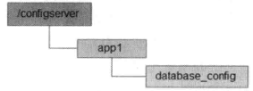

我们将需要集中管理的配置信息写入到该数据节点中去，例如：


 

**配置获取**

​		集群中每台机器在启动初始化阶段，首先会从上面提到的ZooKeeper配置节点上读取数据库配置信息，同时，客户端还需要在该配置节点上注册一个数据变更的Watcher监听，一旦发生节点数据变更，所有订阅的客户端都能够获取到数据变更通知。

**配置变更**

​		在系统运行过程中，可能会出现需要进行数据库切换的情况，这个时候就需要进行配置变更。借助ZooKeeper，我们只需要对ZooKeeper上配置节点的内容进行更新，ZooKeeper就能够帮助我们将数据变更的通知发送到各个客户端，每个客户端在接收到这个变更通知后，就可以重新进行最近数据的获取了。

## Master选举

​		在分布式系统中，Master往往用来协调集群中其他系统单元，具有对分布式系统状态变更的决定权。例如，在一些读写分离的应用场景中，客户端的写请求往往是有Master来处理的；而在另一些场景中，Master则常常负责处理一些复杂的逻辑，并将处理结果同步给集群中其他单元。Master选举可以说是ZooKeeper最典型的应用场景了。

​		下面我们结合“一种海量数据处理与共享模型”这个例子来看看ZooKeeper在集群Master选举中的应用场景：在分布式环境中，经常会碰到这样的应用场景：集群中的所有系统单元需要对前端业务提供数据，比如一个商品ID，或者是一个网站轮播广告的广告ID（通常出现在一些广告投放系统中）等，而这些商品ID或是广告ID往往需要从一系列的海量数据处理中计算得到，这通常是一个非常耗I/O和CPU资源的过程。鉴于该计算过程的复杂性，如果让集群中的所有机器都执行这个计算逻辑的话，那么将耗费非常多的资源。一种比较好的方法就是只让集群中的部分，甚至只让其中的一台机器去处理数据计算，一旦计算出数据结果，就可以共享给整个机器中的其他所有客户端机器，这样可以大大减少重复劳动，提升性能。

​		这里我们以一个简单的广告投放系统后台场景为例来讲解这个模型。整个系统大体上可以分成客户端集群、分布式缓存系统、海量数据处理总线和ZooKeeper四个部分，如下图：

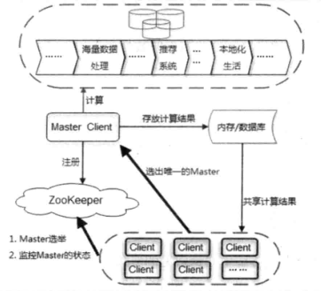

​		首先我们来看看整个系统的运行机制，Client集群每天定时会通过ZooKeeper来实现Master选举。选举产生Master客户端之后，这个Master就会负责进行一系列的海量数据处理，最终计算得到一个数据结果，并将其放置在一个内存/数据库中。同时，Master还需要通知集群中其他所有的客户端从这个内存/数据库中共享计算结果。

​		接下去，我们将重点来看Master选举的过程，首先明确下Master选举的需求：在集群的所有机器中选举出一台机器作为Master。针对这个需求，通常情况下，我们可以选择常见的关系型数据库中的主键特性来实现：集群中的所有机器都向数据库插入一条相同主键ID的记录，数据库会帮助我们自动进行主键冲突检查，也就是说，所有进行插入操作的客户端机器中，只有一台机器能够成功，那么，我们就认为向数据库中成功插入数据的客户端机器称为Master。

​		这个方案确实可行，依靠关系型数据库的主键特性能够很好地保证在集群中选举出唯一的一个Master。但是我们需要考虑的另一个问题是，如果当前选举出的Master挂了，那么该如何处理？谁来告诉我们Master挂了呢？显然，关系型数据库没法通知我们这个事件。而ZooKeeper可以做到这一点。

​		在ZooKeeper创建节点时，有一个重要的特性是：利用ZooKeeper的强一致性，能够很好地保证在分布式高并发情况下节点的创建一定能够保证全局唯一性，即ZooKeeper将会保证客户端无法重复创建一个已经存在的数据节点。也就是说，如果同时有多个客户端请求创建同一个几点，那么最终一定只有一个客户端请求能够创建成功。利用这个特性，就能很容易地在分布式环境中进行Master选举了。

​		如图：一种海量数据处理与共享模型的ZooKeeper节点示意图：

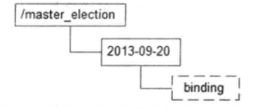

​		客户端集群每天都会定时往ZooKeeper上创建一个临时节点，例如/master_election/2013-09-20/binding。这个过程中，只有一个客户端能够成功创建这个节点，那么这个客户端，都会在节点/master_election/2013-09-20上注册一个子节点变更的Watcher，用于监控当前的Master机器是否还存活，一旦发现当前的Master挂了，那么其余的客户端将会重新进行Master选举。

## 分布式锁

​		分布式锁是控制分布式系统之间同步访问共享资源的一种方式。如果不同的系统或是同一个系统的不同主机之间共享一个或一组资源，那么访问这些资源的时候，往往需要通过一些互斥手段来防止彼此之间的干扰，以保证一致性，在这种情况下，就需要使用分布式锁了。

​		在平时的实际项目开发中，我们往往很少会去在意分布式锁，而是依赖于关系型数据库固有的排他性来实现不同进程之间的互斥。这确实是一种非常简便且被广泛使用的分布式锁实现方式。然而有一个不争的事实是，目前绝大多数大型分布式系统的性能瓶颈都集中在数据操作上。因此，如果上层业务再给数据库添加一些额外的锁，例如行锁、表锁甚至是繁重的事务处理，那么会数据更加不堪重负。

​		下面我们来看看使用ZooKeeper如何实现分布式锁，这里主要讲解排他锁和共享锁两类分布式锁。

### 排他锁（写锁或独占锁）

​		如果事务T1对数据对象O1加上了排他锁，那么整个加锁期间，只允许事务T1对O1进行读取和更新操作，其他任何事务都不能再对这个数据对象进行任何类型的操作，直到T1释放了排他锁。

​		排他锁的核心是如何保证当前有且仅有一个事务获得锁，并且锁被释放后，所有正在等待获取锁的事务都能够被通知到。

**定义一个锁**

​		在通常的Java开发编程中，有两种常见的方式可以用来定义锁，分别是synchronized机制和JDK5提供的ReentrantLock。然而在ZooKeeper中是通过ZooKeeper上的数据节点来表示一个锁，例如/exclusive_lock节点就可以被定义为一个锁，如下图：

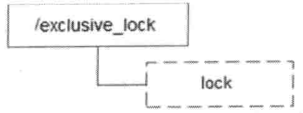

**获取锁**

​	在需要获取排他锁时，所有的客户端都会视图通过调用create()接口，在/exclusive_lock节点下创建临时子节点，ZooKeeper可以保证在所有的客户端中，最终只有一个客户端能够创建成功，那么就可以认为该客户端获取了锁。同时没有获取到锁的客户端会在/exclusive_lock节点上注册一个子节点变更的Watcher监听，以便实时监听到lock节点的变更情况。

**释放锁**

释放锁有两种情况：

* 当前获取锁的客户端机器发生宕机，那么ZooKeeper上的这个临时节点就会被移除；

* 正常执行完业务逻辑后，客户端就会主动将自己创建的临时节点删除

​	无论在什么情况下移除了lock节点，ZooKeeper都会通知所有在/exclusive_lock节点上注册了子节点变更Watcher监听的客户端。这些客户端在接收到通知后，再次重新发起分布式锁获取，即重复“获取锁”的过程。

整个排他锁的获取和释放流程如下：

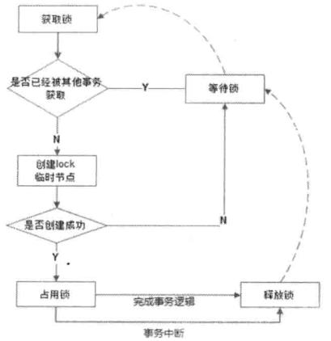

### 共享锁（读锁）

​	如果事务T1对数据对象O1加上了共享锁，那么当前事务只能对O1进行读取操作，其他事务也只能对这个数据对象加共享锁，直到该数据对象上的所有共享锁都被释放。

​	共享锁和排他锁的区别在于，排他锁的数据对象只对一个事务可见，而共享锁的数据对所有事务都可见。

 

**定义锁**

​	和排他锁一样，同样是通过ZooKeeper上的数据节点来表示一个锁，如下图：

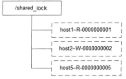

 

**获取锁**

​	在需要获取共享锁时，所有客户端都会到/shared_lock这个节点下面创建一个临时顺序节点；

​	如果当前是读请求，那么就创建例如/shared_lock/193.168.0.1-R-0000000001节点；

​	如果是写请求，那么就创建例如例如/shared_lock/193.168.0.1-W-0000000001的节点。

**判断读写顺序**

​	根据共享锁的定义，不同的事务都可以同时对同一个数据对象进行读操作，而更新操作必须在当前没有任何事务进行读操作的情况下进行，基于这个原则，ZooKeeper分布式读写顺序大致可以分为如下4个步骤：

1、获取/shared_lock节点下的所有子节点，并对该节点注册子节点变更的Watcher监听。

2、确定自己的节点序号在所有子节点中的顺序

3、 对于读请求：

​	如果没有比自己序号小的子节点，或是所有比自己序号小的子节点都是读请求，那么表明自己已经成功获取到共享锁，同时开始执行读取逻辑。如果比自己序号小的子节点中有写请求，那么就需要进入等待。

对于写请求：

​	如果自己不是序号最小的子节点，那么就需要进入等待。

4、接收到Watcher通知后，重复步骤1

 

**释放锁**

​	释放锁的逻辑和排他锁是一致的，这里不再赘述。

## 分布式队列

​	业界有不少分布式队列产品，比如ActiveMQ、Kafka和HornetQ等消息中间件（或称为消息队列）。ZooKeeper也能实现分布式队列。分布式队列可以分为两大类：一种常规的先入先出队列，另一种是等到队列元素集聚之后才同意安排执行的Battier模型。

### FIFO：先入先出

​	ZooKeeper实现FIFO队列和使用ZooKeeper实现共享锁的实现非常类似。FIFO队列就类似于一个全写的共享锁模型，大体的设计思路是：所有客户端都会到/queue_fifo这个节点下面创建一个临时顺序节点，如下图：

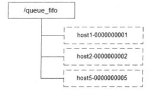

​	创建完节点之后，根据如下4个步骤来确定执行顺序：

1、通过getChildren()接口来获取/queue_fifo节点下的所有子节点，即获取队列中所有的元素；

2、确定自己的节点序号在所有子节点中的顺序；

3、如果自己不是序号最小的子节点，那么就需要进入等待，同时向比自己序号小的最后一个节点注册Watcher监听。

4、接收到Watcher通知后，重复步骤1.

整个FIFO队列的工作流程如下：

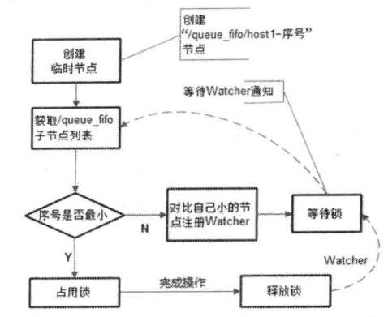

 

### Barrier：分布式屏障

​	Barrier原意是指障碍物、屏障，而在分布式系统中，特指系统之间的一个协调条件，规定了一个队列的元素必须都集聚后才能统一进行安排，否则一直等待。这往往出现在那些大规模分布式并行计算的应用场景上：最终的合并计算需要基于跟多并行计算的子结果来进行。

​	大致的设计思想如下：开始时，/queue_barrier节点是一个已经存在的默认节点，并且将其节点的数据内容赋值为一个数字n来代表Barrier值，例如n=10，表示只有当/queue_barrier节点下的子节点个数达到10后，才会执行操作。所有的客户端都会到/queue_barrier节点下创建一个临时节点，如下图：

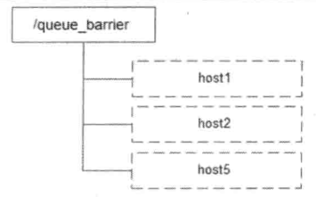

 

创建完节点之后，根据如下5个步骤来确定执行顺序：

1、通过调用getData()接口获取/queue_barrier节点的数据内容：10；

2、通过调用getChildren()接口获取/queue_barrier节点下的所有子节点，即获取队列中的所有元素，同时注册对子节点列表变更的Watcher监听

3、统计子节点的个数

4、如果子节点个数还不足10个，那么需要进入等待

5、接收到Watcher通知后，重复步骤2

整个Barrier队列的工作流程，如下图：

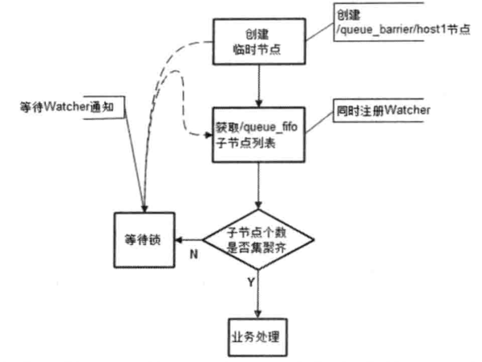

 

 

# 第七章 ZooKeeper技术内幕

## 数据模型（ZNode）

​		ZooKeeper的视图结构和标准的Unix文件系统非常类似，但没有引入文件系统中目录和文件等相关概念，而是使用了其特有的“数据节点”概念，我们称之为ZNode。ZNode是ZooKeeper中数据的最小单元，每个ZNode上都可以保存数据，同时还可以挂载子节点，因此构成了一个层次化的命名空间，我们称之为树，如下：


 

## 全局唯一的事务ID（ZXID）

​		在《事务处理：概念与技术》一书中提到，事务是对物理和抽象的应用状态上的操作集合。在现在的计算机科学中，狭义上的事务通常指的是数据库事务，一般包括了一系列对数据库有序的读写操作，这些数据库事务具有所谓的ACID特性。

​		**在ZooKeeper中，事务是指能够改变ZooKeeper服务器状态的操作，我们称之为事务操作，一般包括数据节点创建与删除、数据节点内容更新和客户端会话创建与失效等操作。**对于每一个事务请求，ZooKeeper都会为其分配一个全局唯一的事务ID，用ZXID来表示，通常是一个64为的数字。每一个ZXID对应一次更新操作，从这些ZXID中可以间接地识别出ZooKeeper处理这些更新操作请求的全局顺序。

## ZNode节点的类型

​		在ZooKeeper中，每个数据节点都是由生命周期的，其生命周期的长短取决于数据节点的节点类型。在ZooKeeper中，节点类型可以分为持久节点、临时节点和顺序节点三大类，具体在节点创建过程中，通过组合使用，可以生成以下四种组合类型节点：

* **持久节点：**

  持久节点是指该数据节点被创建之后，就会一直存在于ZooKeeper服务器上，直到有删除操作来主动清除这个节点。

* **持久顺序节点：**

  持久顺序节点的基本特性和持久节点是一致的，额外的特性表现在顺序性上。在ZooKeeper中，每个父节点都会为它的第一级子节点维护一份顺序，用于记录每个子节点创建的先后顺序。基于这个顺序特性，在创建子节点的时候，可以设置这个标记，那么在创建节点过程中，ZooKeeper会自动为节点名加上一个数字后缀，作为一个新的、完整的节点名。另外需要注意的是，这个数字后缀的上限是整型的最大值。

* **临时节点：**

  临时节点的生命周期和客户端的会话绑定在一起，也就是说，如果客户端会话失效，那么这个节点就会被自动清理掉。注意，这里提到的客户端会话失效，而非TCP连接断开。另外，ZooKeeper规定了不能基于临时节点来创建子节点，及临时节点只能作为叶子节点。

* **临时顺序节点：**

  临时顺序节点和临时节点一样，它只是在临时节点的基础上，添加了顺序的特性。 

## 节点的状态信息

​		每个数据节点除了存储了数据内容之外，还存储了数据节点本身的一些状态信息。我们可以使用get命令来获取一个数据节点的内容，如图：


从返回结果中，我们可以看到，第一行是当前数据节点的数据内容，从第二行开始就是节点的状态信息了，这其实就是数据节点的Stat对象的格式化输出：

 

## 版本

 		ZooKeeper中版本的概念表示的是对数据节点的数据内容、子节点列表和节点ACL信息的修改次数，我们以version这种类型的版本来说明：在一个数据节点被创建完毕后，节点的version值是0，表示“当前节点自从创建之后，被更新过0次”。如果对该节点的数据内容进行更新，那么version值就会变成1。需要注意的是version值表示的是对数据节点数据内容的变更次数，强调的是变更次数，因此即使前后两次变更没有使得数据内容的值发生变化，version的值依然会变更。

**三种类型的版本**

 	ZooKeeper中每个数据节点都具有三种类型的版本信息，分别是version，cversion和aversion。对数据节点的任何更新操作都会引起版本号的变化。

* **version：**当前数据节点数据内容的版本号

* **cversion：**当前数据节点子节点的版本号

* **aversion：**当前数据节点ACL变更版本号

**版本的作用**

​		在了解版本的作用前，我们先来了解下“锁”的概念：

 		一个多线程，尤其是分布式系统，在运行过程中往往需要保证数据访问的排他性。例如在最常见的车站售票系统上，在对系统中车票“剩余量”的更新处理中，我们希望在针对某个时间点的数据进行更新操作时（这可能是一个极短的时间间隔，例如几秒或几毫秒，甚至几纳秒，在计算机科学的有些应用场景中，几纳秒可能也算不上太短的时间间隔），数据不会因为其他人或系统的操作再次发生变化。也就是说，车站的售票员在卖票的过程中，必须要保证在自己的操作过程中，其他售票员不会同时也在出售这个车次的车票。

​		为了上面这个场景的正常运作，一种可能的做法或许是这样，车站某售票窗口的售票员突然向其他售票员喊一声：“现在你们不要出售杭州到北京的XXX次车票！”然后当他售票完毕后，再次通知大家：“该车次已经可以售票啦！”。

 		当然在现实生活中，不会依靠怎么原始的人工方式来实现数据访问的排他性，但这个例子给我们的启发是：在并发环境中，我们需要通过一些机制来保证这些数据在某个操作过程中不会被外界修改，我们称这样的机制为“锁机制”。在数据库技术中，通常提到的“悲观锁”和“乐观锁”就是这种机制的典型实现。

```
悲观锁和乐观锁的概念

    悲观锁（Pessimistic Lock）：
    
        悲观锁，又被称作悲观并发控制，是数据库中一种非常典型且非常严格的并发控制策略。悲观锁具有强烈的独占和排他特性，能够有效地避免不同事物对同一数据并发更新而造成的数据一致性问题。在悲观锁的实现原理中，如果一个事务（假定事务A）正在对数据进行处理，那么在整个处理过程中，都会将数据出锁定状态，在这期间，其他事务将无法对这个数据进行更新操作，直到事务A完成对该数据的处理，释放了对应的锁之后，其他事务才能够重新竞争来对数据进行更新操作。也就是说，对于一份独立的数据，系统只分配了一把唯一的钥匙，谁获得了这把钥匙，谁就有权力更新这份数据。一般我们认为，在实际生产应用中，悲观锁策略适合解决那些对于数据更新竞争十分激烈的场景，在这类场景中，通常采用简单粗暴的悲观锁机制来解决并发控制问题。

    乐观锁（Optimistic Lock）：

        乐观锁，又被称作乐观并发控制，也是一种常见的并发控制策略。相对于悲观锁而言，乐观锁机制显得更加宽松与友好。从上面对悲观锁的讲解中我们可以看到，悲观锁假定不同事物之间的处理一定会出现互相干扰，从而需要在一个事务从头到尾的过程中都对数据进行加锁处理。而乐观锁则正好相反，它假定多个事务在处理过程中不会彼此影响，因此在事务处理的绝大部分时间里不需要进行加锁处理。当然，既然有并发，就一定会存在数据更新冲突的可能。在乐观锁机制中，在更新请求提交之前，每个事务都会首先检查当前事务读取数据后，是否有其他事务对该数据进行了修改。如果其他事务有更新的话，那么正在提交的事务就需要回滚。乐观锁通常适合使用在数据并发竞争不大，事务冲突较少的应用场景中。

    总结

        悲观锁每次获取数据的时候都会进行加锁，确保在自己使用的过程中数据不会被别人修改，使用完成后进行数据解锁。由于数据进行加锁，期间对该数据进行读写的其他线程都会进行等待。乐观锁每次获取数据的时候都不会进行加锁，但是在更新数据的时候需要判断该数据是否被别人修改过。如果数据被其他线程修改，则不进行数据更新，如果数据没有被其他线程修改，则进行数据更新。由于数据没有进行加锁，期间该数据可以被其他线程进行读写操作。
```

 		从上面的讲解中，**我们其实可以把一个乐观锁控制的事务分成如下三个阶段：数据读取、写入校验和数据写入，其中写入校验是整个乐观锁控制的关键所在**。在写入校验阶段，事务会检查数据在读取阶段后是否有其他事务对数据进行过更新，以确保数据更新的一致性。那么，如果来进行写入校验呢？我们首先可以来看下JDK中最典型的乐观锁实现，CAS。简单地讲就是“对于值V，每个更新前都会对比其值是否是预期值A，只有符合预期，才会将V原子化地更新到新值B”，其中是否符合预期便是乐观锁中的“写入校验”阶段。

​		好了，现在我们再回过头来看看ZooKeeper中版本的作用。**事实上，在ZooKeeper中，version属性正是用来实现乐观锁机制中的“写入校验”的，如果写入校验时两个版本不匹配，则会抛出BadVersionException异常。**

 

## Watcher机制（数据变更通知）

​	一个典型的发布/订阅系统定义了一种一对多的订阅关系，能够让多个订阅者同时监听某一个主体对象，当这个主体对象发生变化时，会通知所有订阅者，使它们能够做出相应的处理。

​	ZooKeeper引入了Watcher机制来实现这种分布式的通知功能：ZooKeeper允许客户端向服务端注册一个Watcher监听，当服务端的一些指定事件触发了这个Watcher，那么就会想指定客户端发送一个事件通知来实现分布式的通知功能。

Watcher注册与通知的过程如下：


​	ZooKeeper的Watcher机制主要包括客户端线程、客户端WatcherManager和ZooKeeper服务器三个部分

​	客户端在ZooKeeper注册Watcher的同时，会将Watcher对象存储在客户端的WatchManager中，ZooKeeper触发Watcher事件后，会向客户端发送通知，客户端从WatcherManager中取出对应的Watcher对象来执行回调逻辑。

## ACL

 

## ZooKeeper客户端

ZooKeeper的客户端主要由以下几个核心组件组成：

* **ZooKeeper实例**：客户端的入口

* **ClientWatchManager**：客户端Watcher管理器

* **HostProvider**：客户端地址列表管理器

* **ClientCnxn**：客户端核心线程，其内部又包含两个线程，即SendThread和EventThread。前者是一个I/O线程，主要负责ZooKeeper客户端和服务器之间的网络I/O通信；后者是一个事件线程，主要负责服务端事件进行处理。

### ZooKeeper客户端会话的创建过程

​		ZooKeeper客户端的初始化与启动环节，实际上就是ZooKeeper对象的实例化过程，具体请参照“java客户端API--创建会话”。

客户端的整个初始化和启动过程大体可以分为以下3个步骤：

1、设置默认Watcher

2、设置ZooKeeper服务器地址列表

3、创建ClientCnxn

​		如果在ZooKeeper的构造方法中传入一个Watcher对象的话，那么ZooKeeper就会将这个Watcher对象保存在ZKWatchManager的defaultWatcher中，作为整个客户端会话期间的默认Watcher。


 

#### 第一阶段：初始化阶段

1、初始化ZooKeeper对象，通过调用ZooKeeper的构造方法实例化一个ZooKeeper对象，在初始化过程中会创建一个客户端Watcher管理器ClientWatcherManager。

2、设置会话默认Watcher 如果构造方法中传入了一个Watcher对象，那么客户端将这个Watcher对象作为默认Watcher保存到ClientWatcherManager中。

3、构造ZK服务器地址列表管理器HostProvider 对于构造器中传入的服务器端地址，客户端将其保存在服务器地址列表管理器HostProvider中。

4、创建并初始化客户端网络连接 ZooKeeper客户端首先会创建一个网络连接器ClientCnxn,用来管理客户端与服务器的网络交互。另外，客户端在创建 ClientCnxn的同时还会初始化客户端两个核心队列outGoingQueue和pendingQueue, 分别作为客户端请求组发送队列和服务端响应等待队列。

5、初始化SendThread和EventThread 客户端会创建两个核心网络线程SendThread和EventThread,前者用于管理客户端和服务端之间的所有网络I/O，后者则用于进行客户端的事件处理。 同时，客户端还会将ClientCnxnSocket分配给SendThread作为底层网络I/O处理器，并初始化EventThread的待处理事件队列waitingEvents，用于存放所有等待被客户端处理的事情。

 

#### 第二阶段：会话创建阶段

6、启动SendThread和EventThread。 SendThread首先会判断当前客户端的状态，进行一系列请理性工作，为客户端发送“会话创建”请求做准备。 

 7、获取一个服务器地址。 在开始创建TCP之前，SendThread首先需要获取一个Zookeeper服务器的目标地址， 这通常是从HostProvider中随机获取出一个地址， 然后委托给ClientCnxnSocket去创建与Zookeeper服务器之间的TCP连接。 

8、创建TCP连接。获取一个服务器地址后，ClientCnxnSocket负责和服务器创建一个TCP长连接。 

9、构造ConnectRequest请求。 在TCP连接创建完毕后，可能有的读者会认为，这样是否就说明已经和Zookeeper服务器完成连接了呢？ 其实不然，上面的步骤只是纯粹地从网络TCP层完成了客户端与服务端之间的Socket连接，但远未完成Zookeeper客户端的会话创建。 SendThread会负责根据当前客户端的实际设置，构造出一个ConnectRequest请求，该请求代表了客户端试图与服务端创建一个会话。 同时，Zookeeper客户端还会进一步将该请求包装成网络I/O层的Packet对象，放入发送队列outgoingQueue中去。 

10、发送请求。 当客户端请求准备完毕后，就可以开始向服务端发送请求了。 ClientCnxnSocket负责从outgoingQueue中取出一个待发送的Packet对象，将其序列化成ByteBuffer后，向服务端进行发送。

#### 第三阶段：响应处理阶段

11、响应处理阶段 接受服务器端响应。ClientCnxnSocket接受到服务端响应后，会首先判断当前的客户端状态是否是“已初始化”， 如果尚未完成初始化，那么就认为该响应一定是会话创建请求的响应，直接交由readConnectResult方法来处理该响应。 

12、处理Response。 ClientCnxnSocket会对接受到的服务端响应进行反序列化，得到ConnectResponse对象，并从中获取到Zookeeper服务端分配的会话SessionId。 

13、连接成功。 连接成功后，一方面需要通知SendThread线程，进一步对客户端进行会话参数的设置，包括readTimeout和connectTimeout等，并更新客户端状态， 另一方面，需要通知地址管理器HostProvider当前成功连接的服务器地址。 

14、生成事件：SyncConnected-None。 为了能够让上层应用感知到会话的成功创建，SendThread会生成一个事件SyncConnected-None， 代表客户端与服务器会话创建成功，并将该事件传递给EventThread线程。 

15、查询Watcher。 EventThread线程收到事件后，会从ClientWatchManager管理器中查询出对应的Watcher， 针对SyncConnected-None事件，那么就直接找出存储的默认Watcher,然后将其放到EventThread的watingEvents队列中去。 

16、处理事件。 EventThread不断的从watingEvents队列中取出待处理的Watcher对象，然后直接调用该对象的process接口方法，以达到触发Watcher的目的。

### 服务器地址列表

​		在使用ZooKeeper构造器方法时，用户传入的ZooKeeper服务器地址列表，即connectString参数，通常是这样一个使用英文逗号分隔的多个IP地址和端口的字符串：

```
192.168.0.1:2181,192.168.0.2:2181,192.168.0.3:2181,
```

​		从这个地址串中我们可以看出，ZooKeeper客户端允许我们将服务器的所有地址都配置在一个字符串上，于是一个问题就来了；ZooKeeper客户端在连接服务器的过程中，是如何从这个服务器列表中选择服务器的呢？是按序访问，还是随机访问呢？

​		ZooKeeper客户端内部在接收到这个服务器地址列表后，会将其首先放入一个ConnectStringParser对象中封装起来。ConnectStringParser是一个服务器地址列表的解析器，该类的结构如下：

```java
public final class ConnectStringParser {

    /**
     * zk根目录：例如，192.168.1.1:2181,192.168.1.2:2181,192.168.1.3:2181/zk-book，这样就指定了该客户端连接上ZooKeeper服务器之后，
     * 所有对ZooKeeper的操作，都会基于这个根目录。例如，客户端对/foo/bar的操作，都会指向节点的操作，都会基于这个根目录，例如，客户端对/foo/bar的操作，
     * 都会指向节点/zk-book/foo/bar——这个目录也叫Chroot，即客户端隔离命名空间。
     */
    private final String chrootPath;

    /** 该集合保存了zk的服务机器，每个InetSocketAddress表示一个zk服务 */
    private final ArrayList<InetSocketAddress> serverAddresses = new ArrayList<InetSocketAddress>();
}
```

​		ConnectStringParser解析器将会对传入的connectString做两个主要处理：解析chrootPath；保存服务器地址列表。

**Chroot：客户端隔离命名空间**

​		在3.2.0及其之后版本的ZooKeeper中，添加了“Chroot”特性，该特性允许每个客户端为自己设置一个命名空间。如果一个ZooKeeper客户端设置了Chroot，那么该客户端对服务器的任何操作，都会将被限制在其自己的命名空间下。

​		举个例子来说，如果我们希望为X分配 /app/X 下的所有子节点，那么该应用可以将其所有zk客户端的Chroot设置为/app/X的。一旦设置了Chroot之后，那么对于这个客户端来说，所有的节点路径都以/app/X为根节点，它和zk发起的所有请求中相关的节点路径，都将是一个相对路径（相对于/app/X的路径）。例如通过zk客户端API创建节点/test_chroot，那么实际上再服务端被创建的节点是/app/Xtest_chroot。通过设置Chroot，我们能够将一个客户端应用于zk服务端的一颗子树相对应，在那些多个应用共用一个zk集群的场景下，这个对于实现不同应用之间的相互隔离非常有帮助。

​		客户端可以通过在connectString中添加后缀的方式来设置Chroot，如下所示：

```
192.168.1.1:2181,192.168.1.2:2181,192.168.1.3:2181/app/X
```

将这样一个connectString传入客户端的ConnectStringParser后就能够解析出Chroot并保存在chrootPath属性中。


**HostProvider：地址列表管理器**

​		在ConnectStringParser解析器中会对服务器地址做一个简单的处理，并将服务器地址和相应的端口封装成一个InetSocketAddress对象，以ArrayList形式保存在ConnectStringParser.serverAddresses属性中。然后，经过处理的地址列表会被进一步封装到StaticHostProvider类中。

HostProvider接口源码如下：

```java
public interface HostProvider {

    /**
     * 表示连接zk服务器地址的个数，该返回值不可以为0，也就说说，至少有个zk服务
     *
     * @return
     */
    public int size();

    /**
     * 下一个要连接的主机，该方法必须返回一个合法的InetSocketAddress对象，也就是说，不能返回null或其他不合法的Inet SocketAddress
     * 
     * @param spinDelay 所有主机都尝试一次的等待时间，单位毫秒
     */
    public InetSocketAddress next(long spinDelay);

    /**
     * 客户端成功连接zk时，会调用该方法通知HostProvider，HostProvider通过该通知重置其内部状态
     */
    public void onConnected();

    /**
     * 更新服务器列表。如果需要更改连接以实现负载平衡，则返回true，否则返回false。
     *
     * @param serverAddresses   新的zk服务器列表
     * @param currentHost       表示此客户端当前连接到的主机
     * @return
     */
    boolean updateServerList(Collection<InetSocketAddress> serverAddresses, InetSocketAddress currentHost);
}
```


**StaticHostProvider**

* **解析服务器地址：**

针对ConnectStringParser.serverAddresses集合中那些没有被解析的服务器地址，StaticHostProvider首先会对这些地址逐个进行解析，然后再放入serverAddresses集合中去。同时，使用Collections工具类的shuffle方法来将这个服务器地址列表进行随机的打散。

* **获取可用的服务器地址：**

通过调用StaticHostProvider的next()方法，能够从StaticHostProvider中获取一个可用的服务器地址。这个next()方法并非简单地从serverAddresses中一次获取一个服务器地址，而是现将随机打散后的服务器地址列表拼装成一个环形循环队列，如下图所示。注意，这个随机过程是一次性的，也就是说，之后的使用过程中一直是按照这样的顺序来获取服务器地址的。


举个例子来说，假如客户端传入这样一个地址列表：”host1,host2,host3,host4,host5“。经过一轮随机打散后，可能的一种顺序变为了”host2,host4,host1,host5,host3“，并且形成了上图所示的循环队里。此外，HostProvider还会为该循环队列创建两个游标：currentIndex和lastIndex。currentIndex表示循环队列中当前遍历到的那个元素位置，lastIndex表示当前正在使用的服务器地址位置。初始化的时候，currentIndex和lastIndex的值都为-1。

在每次尝试获取一个服务器地址的时候，都会首先将currentIndex游标向前移动1位，如果发现游标移动超过了整个地址列表的长度，那么就重置为0，回到开始的位置重新开始，这样一来，就实现了循环队列。当然，对于那些服务器地址列表提供得比较少的场景，StaticHostProvider中做了一个小技巧，就是如果发现当前游标提供比较少的场景，StaticHostProvider中做了一个小技巧，就是如果发现当前游标的位置和上次已经使用过的地址位置一样，即当currentIndex和lastIndex游标值相同时，就进行spinDelay毫秒时间的等待。

总的来说，StaticHostProvider就是不断地从上图所示环形地址列表队列中去获取一个地址，整个过程非常类似于”Round Robin“的调度策略。


### ClientCnxn：网络I/O

​		ClientCnxn是ZooKeeper客户端的核心工作累，负责维护客户端与服务端之间的网络连接并进行一系列网络通信。我们来看看ClientCnxn内部的工作原理。

#### Packet

​		Packet是ClientCnxn内部定义的一个对协议层的封装，作为ZooKeeper中请求与响应的载体，其数据结构如下：


​		从上图可以看到，Packet中包含了最基本的请求头（requestHeader）、响应头（replyHeader）、请求体（request）、响应体（response）、节点路径（clientPath/serverPath）和注册的Watcher（watchRegistration）等信息。

​		针对Packet中这么多的属性，读者可能疑惑它们是否都会在客户端和服务器之间进行网络传输？答案是是否定的。Packet的createBB()方法负责对象Packet对象进行序列化，最终生成可用于底层网络传输的ByteBuffer对象。在这个过程中，只会将requestHeader、request和readOnly三个属性进行序列化，其余属性都保存在客户端的上下文中，不会进行与服务端之间的网络传输。

#### outgoingQueue和pendingQueue

​		ClientCnxn中，有两个比较核心的队列outgoingQueue和pendingQueue，分别代表客户端的请求发送队列和服务端响应的等待队列。Outgoing队列是一个请求发送队列，专门用于存储那些需要发送到服务端的Packet集合。Pending队列是为了存储那些已经从客户端发送到服务端的，但是需要等待服务端响应的Packet集合。

####ClientCnxnSocket

ClientCnxnSocket定义了底层Socket通信的接口。在zk 3.4.0以前的版本中，客户端的这个底层通信层并没有被独立出来，而是混合在了ClientCnxn代码中。但后来为了使客户端代码结构更为清晰，同时也是为了便于对底层Socket层进行扩展（例如使用Netty来实现），因此从3.4.0版本开始，抽取出了这个接口类。在使用zk客户端的时候，可以通过在zookeeper.clientCnxnSocket这个系统变量中配置ClientCnxnSocket实现类的全类名，以指定底层Socket通信层的自定义实现，例如：

```
-Dzookeeper.clientCnxnSocket=org.apache.zookeeper.ClientCnxnSocketNIO
```

在zk中，器默认的实现是ClientCnxnSocketNIO。该实现类使用java原生的NIO接口，其核心是doIO逻辑，主要负责对请求的发送和相应的接收过程。

####请求发送

在正常情况下（即客户端与服务端之间的TCP连接正常且会话有效的情况下），会从outgoingQueue队列中提取出一个可发送的Packet对象，同时生成一个客户端请求序号XID并将其设置到Packet请求头中去，然后将其序列化后进行发送。这里提到了”获取一个可发送的Packet对象“，那么什么样的Packet是可发送的呢？在outgoingQueue队列中的Packet整体上是按照先进先出的顺序被处理的，但是如果检测到客户端与服务端之间正在处理SASL权限的话，那么这些不含请求头和Packet（例如会话创建请求）是可以被发送的，其余的都无法被发送。

请求发送完毕后，会立即将该Packet保存到pendingQueue队列中，以便等待服务端响应返回后进行相应的处理，入下图：


####响应接收

客户端获取到来自服务端的完整响应数据后，根据不同的客户端请求类型，会进行不同的处理。

* 如果检测到当前客户端还尚未进行初始化，那么说明当前客户端与服务端之间正在进行会话建立，那么久直接将接收到的ByteBuffer（incomingBuffer）序列化成ConnectResponse对象。
* 如果当前客户端已经处于正常的会话周期，并且接收到的服务端响应是一个事件，那么zk客户端会将接收到的ByteBuffer（incomingBuffer）序列化成WatcherEvent对象，并将该事件放入待处理队列中。
* 如果是一个常规的请求响应（指的是Create、GetData和Exist等操作请求），那么会从pendingQueue队列中取出一个Packet来进行响应的处理。zk客户端首先会通过检验服务端响应中包含的XID值来确保请求处理的顺序性，然后再将接收到的ByteBuffer（incomingBuffer）序列化成相应的Response对象。

最后，会在finishPacket方法中处理Watcher注册等逻辑。

 

####SendThread

SendThread是客户端ClientCnxn内部一个核心的I/O调度线程，用于管理客户端和服务端之间的所有网络I/O操作。在zk客户端的实际运行过程中，一方面，SendThread维护了客户端与服务端之间的会话生命周期，其通过在一定的周期频率内向服务器发送一个Ping包来实现心跳检测。同时，在会话周期内，如果客户端与服务端之间出现TCP连接断开的情况，那么就会自动透明化地完成重连接操作。

另一方面，SendThread管理了客户端所有的请求发送和相应操作，器将上传客户端API操作转换成相应的请求协议并发送到服务端，并完成对同步调用的返回和异步调用的回调。同时，SendThread还负责将来自服务端的事件传递给EventThread去处理。

####EventThread

EventThread是客户端ClientCnxn内部的另一个核心线程，负责客户端的事件处理，并触发客户端注册的Watcher监听。EventThread中有一个waitingEvents队列，用于临时存放那些需要被触发的Object，包括那些客户端注册的Watcher和异步接口中注册的回调器AsyncCallback。同时，EventThread会不断地从waitingEvents这个队列中取出Object，识别其具体类型（Watcher或者AsyncCallback），并分别调用process和processResult接口方法来实现对事件的触发和回调。


# 第八章 ZooKeeper运维（未完。。。）

 

## 基本配置

所谓的基本配置是指：这些配置参数都是ZooKeeper运行时所必须的，如果不配置这些参数，将无法启动ZooKeeper服务器。这些基本的配置参数包括：clientPort、dataDir和tickTime。

| 参数名     | 说明                                                         |
| ---------- | ------------------------------------------------------------ |
| clientPort | 该参数无默认值，必须配置，不支持系统属性方式配置。<br/>该参数用于配置当前服务器对外的服务端口，客户端会通过该端口和Zookeeper服务器创建连接，即ZK监听客户端连接的端口，一般设置为2181.<br/>每台zk服务器都可以配置任意可用的端口，同时，集群中的所有服务器不需要保持clientPort端口一致。 |
| dataDir    | 该参数无默认值，必须配置，不支持系统属性方式配置。<br/>该参数用于配置zk服务器的存储快照文件的目录。默认情况下，如果没有配置参数dataLogDir，那么事务日志也会存储在这个目录中。考虑到事务日志的写性能直接影响zk整体的服务能力，因此建议同时通过dataLogDir参数来配置zk事务日志的存储目录。<br/>(内存数据库快照存放地址，如果没有指定事务日志存放地址(dataLogDir)，默认也是存放在这个路径下，建议两个地址分开存放到不同的设备上。) |
| tickTime   | 该参数有默认值：3000，单位是毫秒，可以不配置，不支持系统属性方式配置。<br/>参数tickTime用于配置zk中最小时间单元的长度，很多运行时的时间间隔都是使用tickTime的倍数来表示的。例如，zk中会话的最小超时时间默认是2*tickTime。<br/>(心跳基本时间单位，毫秒级，ZK基本上所有的时间都是这个时间的整数倍)。 |
|            |                                                              |

 

## 高级配置

 下面是zk中一些高级配置参数的使用

* **dataLogDir**：该参数有默认值：dataDir，可以不配置，不支持系统属性方式配置。

  参数dataLogDir用于配置zk服务器存储事务日志文件的目录。默认情况下，zk会将事务日志文件和快照数据存储在同一个目录中，读者应尽量将这两者的目录区分开来。

  另外，如果条件允许，可以将事务日志的存储配置在一个单独的磁盘上。事务日志记录对于磁盘的性能要求非常高，为了保证数据的一致性，zk在返回客户端事务请求响应之前，必须将本次请求对应的事务日志写入到磁盘中。因此，事务日志写入的性能直接决定了zk在处理事务请求时的吞吐。针对同一块磁盘的其他并发读写操作（例如zk运行时日志输出和操作系统自身的读写等），尤其是上文中提到的数据快照操作，会极大地影响事务日志的写性能。因此尽量给事务日志的输出配置一个单独的磁盘或是挂载点，将极大地提升zk的整体性能。

* **initLimit**：该参数有默认值：10，及表示参数tickTime值的10倍，必须配置，且需要配置一个正整数，不支持系统属性方式配置。

  该参数用于配置Leader服务器等待Follower启动，并完成数据同步的时间。Follower服务器在启动过程中，会与Leader简历连接并完成对数据的同步，从而确定自己对外提供服务的起始状态。Leader服务器允许Follower在initLimit时间内完成这个工作。

  通常情况下，运维人员不用太在意这个参数的配置，使用其默认值即可。但如果随着zk集群管理的数据量增大，Follower服务器在启动的时候，从Leader上进行同步数据的时间也会相应变长，于是无法在较短的时间完成数据同步。因此，在这种情况下，有必要适当调大这个参数。 

* **syncLimit**：该参数有默认值：5，即表示是参数tickTime值的5倍，必须配置，且需要配置一个正整数，不支持系统属性方式配置。

  该参数用于配置Leader服务器和Follower之间进行心跳检测的最大延时时间。在zk集群运行过程中，Leader服务器会与所有的Follower进行心跳检测来确定该服务器是否存活。如果Leader服务器在syncLimit时间内无法获取到Follower的心跳检测响应，那么Leader就会认为该Follower已经脱离了和自己的同步。

  通常情况下，运维人员使用该参数的默认值即可，但如果部署zk集群的网络环境质量较低（例如网络延时较大或丢包严重），那么可以适当调大这个参数。

* **snapCount**：该产生有默认值：100000，


 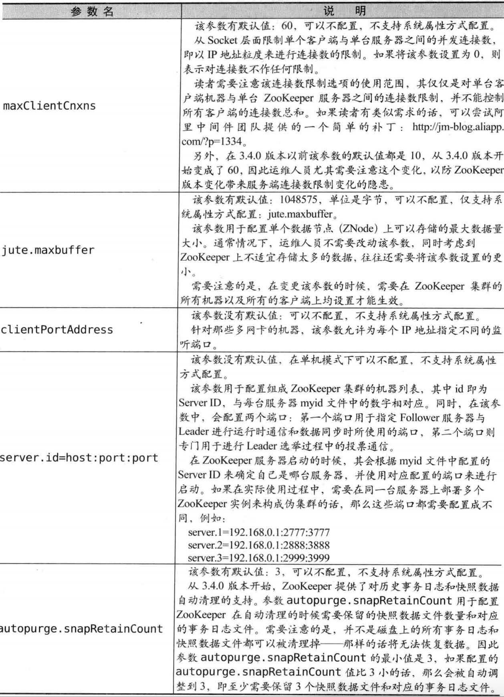


## ZooKeeper四字命令

 

 

## ZooKeeper如何开启远程JMX