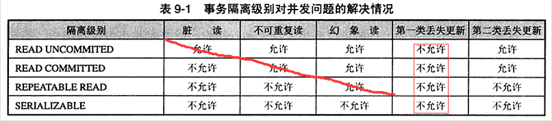
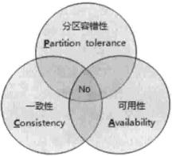
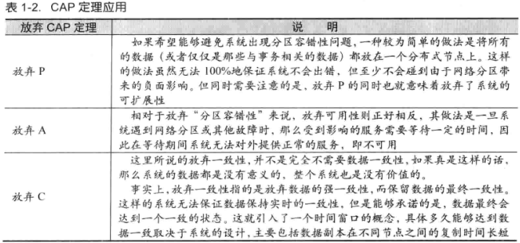

# 第一章 分布式架构

## 分布式系统的概念

​		分布式系统是一个硬件或软件组件分布在不同的网络计算机上，彼此之间仅仅通过消息传递进行通信和协调的系统。

## 分布式系统的特点

一个标准的分布式系统在没有任何特定业务逻辑约束的情况下，都会有如下几个特征：

* **1.分布性：**分布式系统中的计算在空间上随意分布，同时，机器的分布情况也会随时变动。

* **2.对等性：**分布式系统的计算机没有主/从之分，既没有控制整个系统的主机，也没有被控制的从机，组成分布式系统的所有计算机节点都是对等的。副本是分布式系统最常见的概念之一，指的是分布式系统对数据和服务提供的一种冗余方式。在常见的分布式系统中，为了对外提供高可用的服务，我们往往会对数据和服务进行副本处理。数据副本是指在不同的节点上持久化同一份数据，当某一个节点上存储的数据丢失时，可以从副本上读取到该数据，这是解决分布式系统数据丢失问题最为有效的手段。另一类副本是服务副本，指多个节点提供同样的服务，每个节点都有能力接收来自外部的请求并进行相应的处理。

* **3.并发性：**同一个分布式系统中的多个节点，可能会并发地操作一些共享的资源，诸如数据库或分布式存储等，如果准确并高效地协调分布式并发操作也成为了分布式系统架构与设计中最大的挑战之一。

* **4.故障总是会发生：**组成分布式系统的所有计算机，都有可能发生任何形式的故障。一个被大量工程实践所检验过的黄金定理是：任何在设计阶段考虑的异常情况，一定会在系统实际运行中发生，并且，在系统实际运行过程中还会遇到很多在设计时未能考虑到的异常故障。所以，除非需求指标允许，在系统设计时不能放过任何异常情况。

 

## 分布式环境的典型问题

### 1.通信异常

* **网络不可用：**从集中式向分布式演变的过程中，必然引入了网络因素，而由于网络本身的不可靠性，因此也引入了额外的问题。分布式系统需要在各个节点之间进行网络通信，因此每次网络通信都会伴随着网络不可用的风险，网络光纤、路由器或DNS等硬件设备或是系统不可用都会导致最终分布式系统无法顺利完成一次网络通信。

* **网络延迟：**另外，即使分布式系统各节点之间的网络通信能正常进行，其延时也会远大于单机操作。通常我们认为在现代计算机体系结构中，单机内存访问的延时在纳秒数量级（通常是10ns左右），而正常的一次网络通信的延迟在0.1~1ms左右（相当于内存访问延时的105~106倍），如此巨大的延时差别，也会影响消息的收发的过程，因此消息丢失和消息延迟变得非常普遍。

### 2.网络分区（脑裂）

* **局部小集群：**当网络由于发生异常情况，导致分布式系统中部分节点之间的网络延时不断增大，最终导致组成分布式系统的所有节点中，只有部分节点之间能够进行正常通信，而另一些节点则不能，我们将这个现象称为网络分区，俗称“脑裂”。当网络分区出现时，分布式系统会出现局部小集群，在极端情况下，这些局部小集群会独立完成原本需要整个分布式系统才能完成的功能，包括对数据的事务处理，这就对分布式一致性提出了非常大的挑战。

### 3.三态：成功、失败和超时

​		从上面的介绍中，我们已经了解到了分布式环境下，网络可能会出现各式各样的问题，因此分布式系统的每一次请求与响应，存在特有的“三态”概念，及成功、失败与超时。在传统的单机系统中，应用程序在调用一个函数之后，能够得到一个非常明确的响应：成功或失败。而在分布式系统中，由于网络是不可靠的，虽然在绝大部分情况下，网络通信也能够接收到成功或失败的响应，但是当网络出现异常的情况下，就可能会出现超时现象，通常有以下两种情况：

- 由于网络原因，该请求（消息）没有被成功地发送到接收方，而是在发送过程就发生了消息丢失现象。
- 该请求（消息）成功的被接收方法接听后，并进行了处理，但是在将响应反馈给发送方的过程中，发生了消息丢失现象。

当出现这样的超时现象时，网络通信的发起方是无法确定当前请求是否被成功处理的。

### 4.节点故障

​		指的是分布式系统的服务器节点出现宕机的现象。

## ACID基础

​		事务的思想就是“一荣俱荣，一损俱损”。很多复杂事情都需要分步进行，但他们是一个整体，要整体生效，要么整体失效。这种思想在数据库中，就执行多条SQL，要所有都执行成功，要么所有执行失效。

**数据并发问题的5种情况：**

​		一个数据库可能拥有多个客户端，这些客户端以并发的方式访问数据库。数据库中的相同数据可能同时被多个事务访问，如果没有采取必要的隔离措施，就会导致各种并发问题，这些并发问题归结为5类，包3类数据读取问题和2类数据更新问题。

- **脏读：**A事务读取了B事务尚未提交的更改数据。
- **不可重复读：**A事务读取了B事务提交的更改数据。A事务在B事务提交前读取了一次数据，然后在B事务提交后又再一次读取了同一个数据，造成两次读取的数据不一致。
- **幻读：**A事务读取了B事务提交的新增数据。
- **第一类丢失更新：**A事务撤销时，把B事务提交的更新数据覆盖了。
- **第二类丢失更新：**A事务覆盖了B事务提交的数据。

不可重复读和幻读的区别，前者是已经提交的更改（或删除）数据，后者是已经提交新增数据，为了避免这两种情况，采取的对策是不同的，防止读取更改数据只需对操作的数据添加行级别锁，而防止读取新增数据则须添加表级别锁。

 

**数据库事务必须要满足的4个特性（即ACID特性）：**

- **原子性（Atomic）：**表示将组成数据库事务的多个数据库操作看成是一个不可分割的整体，必须所有所有操作执行成功，整个事务才能提交，否则只要有一个操作失败，任何操作必须撤销，让数据返回到执行事务开始之前的状态。
- **一致性（consistency）：**指事务执行的结果必须是使数据库从一个一致性状态变到另一个一致性状态。一致性我们可以理解为正确性的意思，比如在事务T开始时，此时数据库有一种状态，这个状态是所有的数据库对象处于一致的状态，例如数据库完整性约束处于正确的状态，日志记录状态一致等，当事务T提交后，这时数据库又有了一个新的状态，不同的数据，不同的索引，不同的日志等，但此时，约束，数据，索引，日志等各种数据库对象还是要保持一致性（正确性）。 这就是从一个一致性的状态，变到另一个一致性的状态。也就是事务执行后，并没有破坏数据库的完整性约束，一切都是对的。我们再举一个例子，比如我们事先规定a+b=c这样一个表达式规则，就是两个数a和b相加会等于c，现在我们初始状态是a=1，b=9，c=10，此时abc是一种一致性状态（因为他们满足这个规则），现在一个事务T执行完成后，如果说a的值被更新为2，那么c的值也要对应的被更新为11，而此时a=2，b=9，c=11又是一种一致性状态（因为他们也满足a+b=c这个规则），这些一致性状态都满足我们事先规定的a+b=c这个规则。
- **隔离性（Isolation）：**就说各个事务都各自的数据空间，他们各自的操作不会对对方产生干扰。数据库一般有多重事务隔离级别，级别越高，数据一致性越好，但并发性越弱。
- **持久性（Durabiliy）：**事务提交后，所有的数据操作都必须被持久化到数据库中。

在这些特性中，数据的“一致性”是最终目标，其他的特性都是为了达到这个目标的措施、要求或手段。和Java程序采用对象锁机制进行线程同步类似，数据库管理系统采用数据库锁机制保证事务的隔离性。

 

**Spring的事务隔离级别和事务传播级别**

​	传播级别定义的是事务的控制范围，事务隔离级别定义的是事务在**数据库**读写方面的控制范围。

 **原始JDBC的4种数据隔离级别：**

- **Read Uncommited** ：保证了读取过程中不会读取到非法数据。
- **Read Commited:**大多数主流数据库的默认事务等级，保证了一个事务不会读到另一个并行事务已修改但未提交的数据，避免了“脏读取”。该级别适用于大多数系统。
- **Repeatable Read**：保证了一个事务不会修改已经由另一个事务读取但未提交（回滚）的数据。避免了“脏读取”和“不可重复读取”的情况，但是带来了更多的性能损失。
- **Serializable** ：最严格的级别，事务串行化执行，资源消耗最大。
  并不是所有的数据库都支持事务，即使支持事务的数据库也并非支持所有的事务隔离级别，用户可以通过Connection.getMetaData()方法获取DatabaseMetaData对象，并通过该对象的supportTransactions()、supportsTransactionIsolationLevel(int level)方法查看底层数据库的事务支持情况。

Connection默认情况下是自动提交的，也即每条执行的SQL都对应一个事务，为了能够将多条SQL当成一个事务执行，必须先通过Connection.setAutoCommit(false)阻止自动提交，并通过Connection.setTransactionIsolation()设置事务的隔离级别，还可以通过Connection.rollback()回滚事务。下面的典型的JDBC事务数据操作的代码：

```java
Connection con;
try {
    Class.forName("com.mysql.jdbc.Driver");
    con = DriverManager.getConnection(url,userName,password);
    con.setAutoCommit(false);//关闭自动提交机制
    con.setTransactionIsolation(Connection.TRANSACTION_SERIALIZABLE);//设置事务隔离级别
    Statement stmt = con.createStatement();
    stmt.execute("INSERT INTO t_topic VALUES (1,'tom')");
    con.commit();//提交事务
} catch (Exception e) {
    ...
    con.rollback();//回滚事务
} finally {
    ...
}
```

​	**隔离级别越高，越能保证数据的完整性和一致性，但是对并发性能的影响也越大。对于多数应用程序，可以优先考虑把数据隔离级别设为Read Commited，它能够避免脏读，而且具有较好的并发性能。尽管它会导致不可重复读、虚读和第二类丢失更新这些并发问题，在可能出现这类问题的个别场合，可以由应用程序采用悲观锁或乐观锁来控制。**

## 一个分布式事务场景

​	我们可以设想一个最典型的分布式事务场景：一个跨银行的转账操作设计调用两个异地的银行服务，其中一个是本地银行提供的取款服务，另一个则目标银行提供的存款服务，这两个服务本身是无状态并且是相互独立的，共同构成了一个完整的分布式事务。如果从本地银行取款成功，但是因为某种原因存款服务失败了，那么就必须回滚取款前端状态，否则用户可能会发现自己的钱不翼而飞了。

​	从上面这个例子，我们可以看到，一个分布式事务可以看做是由多个分布式的操作序列组成的，例如上面例子中的取款服务和存款服务，通常可以把这一系列分布式的操作序列称为子事务。因此，分布式事务也可以被定义一种嵌套型的事务，同时也就具有了ACID事务特性。但由于在分布式事务中，各个子事务的执行是分布式的，因此要实现一种能够保证ACID特性的分布式事务处理系统就显得格外负责。

## CAP和BASE理论

​	对于本地事务处理或者是集中式的事务处理系统，很显然我们可以采用已经被实践证明很成熟的ACID模型来保证数据的严格一致性。随着分布式事务的出现，传统的单机事务模型已经无法胜任。尤其是对于一个高访问量、高并发的互联网分布式系统来说，如果我们期望实现一套严格满足ACID特性的分布式事务，很可能出现的情况就是在系统的可用性和严格一致性之间出现冲突，因为当我们要求分布式系统具有严格一致性时，很可能就需要牺牲掉系统的可用性。但毋庸置疑的一点是，可用性又是一个所有消费者不允许我们讨价还价的系统属性，比如说像淘宝网这样的在线购物网站，就要求它能够24小时不间断地对外提供服务，而对于一致性，则更加是所有消费者对于一个软件系统的刚需。因此，在可用性和一致性之间永远无法存在一个两全其美的方案，于是如何构建一个兼顾可用性和一致性的分布式系统成为了无数工程师探讨的难题，出现了诸如CAP和Base这样的分布式系统经典理论。

### CAP理论



CAP理论：一个分布式系统不可能同时满足一致性（C：Consistency）、可用性（A：Availability）和分区容错性（P：Partition tolerance）这三个基本需求，最多只能同时满足其中的两项。

#### 1.一致性

​	分布式环境中，一致性是指数据在多个副本之间是否能够保持一致的特性。在一致性的需求下，当一个系统在数据一致的状态下执行更新操作后，应该保证系统的数据仍然处于一致的状态。

​	对于一个将数据副本分布在不同分布式节点上的系统来说，如果对第一个节点的数据进行了更新操作并且更新成功后，却没有使得第二节点上的数据得到相应的更新，于是在对第二个节点的数据进行读取操作时，获取的依然是老数据（或称为脏数据），这就是最典型的分布式数据不一致情况。在分布式系统中，如果能够做到针对一个数据项的更新操作执行成功后，所有的用户都可以读取到其最新的值，那么这样的系统就被认为具有强一致性。

#### 2.可用性

​	可用性是指系统提供的服务必须一直处于可用的状态，对于用户的每一个操作请求总是能够在有限时间内返回结果。这里我们重点看下“有限的时间内”和“返回结果”。

​	**“有限的时间内”：**是指，对于用户的一个操作请求，系统必须能够在指定的时间（即相应时间）内返回对应的处理结果，如果超过了这个时间范围，那么系统就被认为是不可用的。另外，“有限的时间内”是一个在系统设计之初就设定好的系统运行指标，通常不同的系统之间会有很大的不同。比如说，对于一个在线搜索引擎来说，通常在0.5秒内需要给出用户检索结果。用户对于一个系统的请求响应时间的期望值不尽相同。但是，无论系统之间的差异有多大，唯一相同的一点就是对于用户请求，系统必须存在一个合理的响应时间，否则用户便会对系统感到失望。

​	**“返回结果”：**是可用性的另一个非常重要的指标，它要求系统在完成对用户请求的处理后，返回一个正常的响应结果。正常的响应结果通常能够明确地反映出对请求的处理结果，即成功或失败，而不是一个让用户感到困惑的返回结果。比如，在线搜索引擎的例子，如果用户输入指定的搜索关键词后，返回的结果是一个系统错误，通常类似于“OutOfMemoryError”等提示语，那么我们认为此时系统是不可用的。

#### 2.分区容错性

​	分区容错性约束了一个分布式系统需要具有如下特性：分布式系统在遇到任何网络分区故障的时候，仍然需要能够保证对外提供满足一致性和可用性的服务，除非是整个网络环境都发生了故障。

​	网络分区是指在分布式系统中，不同的节点分布在不同的子网络（机房或异地网络等）中，由于一些特殊的原因导致这些子网络之间出现网络不连通的状况，但各个子网络的内部网络是正常的，从而导致整个系统的网络环境被切分成了若干个孤立的区域。需要注意的是，组成一个分布式系统的每个节点的加入与退出都可以看作是一个特殊的网络分区。


#### 总结：




​	从CAP定理中我们可以看出，一个分布式系统不可能同时满足一致性、可用性和分区容错性这三个需求。另一方面，需要明确的一点是，对于分布式系统而言，分区容错性可以说是一个最基本的要求。因为既然是一个分布式系统，那么分布式系统中的组件必然需要被部署到不同的节点，否则也就无所谓分布式系统了，因此必然出现子网络。而对于分布式系统而言，网络问题又是一个必定会出现的异常情况，因此分区容错性也就成为了一个分布式系统必然需要面对和解决的问题。因此系统架构设计师往往需要把精力放在如何根据业务特定在C（一致性）和A（可用性）之间寻求平衡。

### Base理论

​	Base是Basically Available（基本可用）、Soft state（软状态）和Eventually consistent（最终一致性）三个短语的简写。Base是对CAP中一致性和可用性权衡的结果，其来源与对大规模互联网系统分布式实践的总结，是基于CAP定理逐步演化而来的，其核心思想是即使无法做到强一致性，但每个应用都可以根据自身的业务特点，采用适当的方式来使系统达到最终一致性。

#### Base理论的三要素：

- **基本可用：**基本可用是指分布式系统在出现不可预知故障的时候，允许损失部分可用性，注意，这绝不等价于系统不可用。以下两个就是“基本可用”的典型例子。
- **响应时间上损失：**正常情况下，一个在线搜索引擎需要在0.5秒之内返回给用户响应的查询结果，但由于出现故障（比如系统部分机房发生断电或断网故障），查询结果的响应时间增加1~2秒。
- **功能上的损失**：正常情况下，在一个电子商务网站上进行购物，消费者几乎能够顺利地完成每一笔订单，但是在一些节日大促购物高峰的时候，由于消费者的购物行为激增，为了保护购物系统的稳定性，部分消费者可能会被引导到一个降级页面。

**弱状态**

​	弱状态也成为软状态，是指允许系统的数据存在中间状态，并认为该中间状态的存在不会影响系统的整体可用性，即允许系统在不同节点的数据副本之间进行数据同步的过程存在延时。

**最终一致性**

​	最终一致性强调的是系统中所有的数据副本，在经过一段时间的同步后，最终能够达到一个一致的状态。因此，最终一致性的本质是需要系统保护最终数据能够达到一致，而不需要实时保证系统数据的强一致性。

​	亚马逊首席技术官Werner Vogels在2008年发表的一篇经典文章中，对最终一致性进行了非常详细的介绍。他认为最终一致性是一种特殊的弱一致性：系统能够保证在没有其他新的更新操作的情况下，数据最终一定能够达到一致的状态，因此所有客户端对系统的数据访问都能够获取到最新的值。同时，在没有发生故障的前提下，数据达到一致状态的时间延迟，取决于网络延迟、系统负载和数据复制方案设计等因素。

 

在实际工程实践中，最终一致性存在以下5类主要变种：

**因果一致性（Causal consistency）**

 	因果一致性是指，如果进程A在更新完某个数据项后通知了进程B，那么进程B之后对该数据项的访问都应该能够获取到进程A更新后的最新值，并且如果进程B要对该数据项进行更新操作的话，务必基于进程A更新后的最新值，即不能发生丢失更新情况。与此同时，与进程A无因果关系的进程C的数据访问则没有这样的限制。

**读己之所写（Read your writes）**

​	读己之所写是指，进程A更新一个数据项之后，它自己总是能够访问到更新过的最新值，而不会看到旧值。也就是说，对于单个数据获取者来说，其读取到的数据，一定不会比自己上次写入的值旧。因此，读己之所写也可以看作是一种特殊的因果一致性。

**会话一致性（Session consistency）**

​	会话一致性将对系统数据的访问过程框定在了一个会话当中：系统能保证在同一个有效的会话中实现“读己之所写”的一致性，也就是说，执行更能操作之后，客户端能够在同一个会话中始终读取到该数据项的最新值。

**单调读一致性（Monotonic read consistency）**

​	单调读一致性是指如果一个进程从系统中读取出一个数据项的某个值后，那么系统对于该进程后续的任何数据访问都不应该返回更旧的值。

**单调写一致性（Monotonic write consistency）**

 	单调写一致性是指，一个系统需要能够保证来自同一个进程的写操作被顺序地执行。


以上就是最终一致性的五种常见的变种，在实际系统实践中，可以将其中的若干个变种互相结合起来，以构建一个具有最终一致性特性的分布式系统。事实上，最终一致性并不是只有那些大型分布式系统才涉及的特性，许多现代的关系型数据库都采用了最终一致性模型。在现代关系型数据库中，大多都会采用同步和异步方式来实现主备数据复制技术。在同步方式中，数据的赋值过程通常是更新事务的一部分，因此在事务完成后，主备数据库的数据就会达到一致。而在异步方式中，备库的更新往往会存在延时，这取决于事务日志在主备数据库之间传输的时间长短，如果传输时间过长或者甚至在日志传输过程中出现异常导致无法及时将事务应用到备库上，那么很显然，从备库中读取的数据将是旧的，因此就出现了数据不一致的情况。当然，无论是采用多次重试还是人为数据订正，关系型数据库还是能够保证最终数据达到一致，这就是系统提供最终一致性保证的经典案例。

​	总的来说，Base理论面向的大型高可用可扩展的分布式系统，和传统事务的ACID特性是相反的，它完全不同于ACID的强一致性模型，而是提出通过牺牲强一致性来获得可用性，并允许数据在一段时间内是不一致的，但最终达到一致状态。但同时，在实际的分布式场景中，不同业务单元和组件对数据一致性的要求是不同的，因此在具体的分布式系统架构设计过程中，ACID特性与Base理论往往又会结合在一起使用。