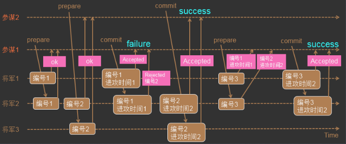

# 第二章 分布式一致性协议

​		为了解决分布式一致性问题，在长期的探索研究过程中，涌现出了一大批经典的一致性协议和算法，其中最著名的就二阶段提交协议、三阶段提交协议和Paxos算法。

​		在分布式系统中，每一个机器节点虽然都能够明确地知道自己在进行事务操作过程中的结果是成功或失败，但却无法直接获取到其他分布式节点的操作结果。因此，当一个事务操作需要跨越多个分布式节点的时候，为了保持事务处理的ACID特性，就需要引入一个称为“协调者（Coordinator）”的组件来统一调度所有分布式节点的执行逻辑，这些节点被称为“参与者（Participant）”。协调者负责调度参与者的行为，并最终决定这些参与者是否要把事务真正进行提交。基于这个思想，衍生了2PC和3PC协议。

## 2PC提交协议

​		2PC（Two-Phase Commit，即二阶段提交），为了使基于分布式系统架构下的所有节点在进行事务处理过程中能保持原子性和一致性而设计的一种算法，通常，2PC也被认为是一种一致性协议。目前，绝大部分的关系型数据库都是采用二阶段提交协议来完成分布式事务处理的，利用该协议能够非常方便地完成所有分布式事务参与者的协调，统一决定事务的提交或回滚，从而能够有效地保证分布式数据一致性，因此2PC被广泛引用在许多分布式系统中。

 

2PC将事务的提交过程分成两个阶段：

### 阶段一：提交事务请求

1、协调者发送事务：协调者向所有参与者发送事务内容，询问是否可以执行事务提交操作，并开始等待各参与者的响应；

2、参与者执行事务：各参与者执行事务，并将Undo和Redo信息记入事务日志中

3、反馈事务操作情况：每个参与者向协调者反馈事务是否可以执行

```
undo日志：
用于存放数据修改被修改前的值，假设修改 tba 表中 id=2的行数据，把Name=’B’ 修改为Name = ‘B2’ ，那么undo日志就会用来存放Name=’B’的记录，如果这个修改出现异常，可以使用undo日志来实现回滚操作，保证事务的一致性。

redo日志：当数据库对数据做修改的时候，需要把数据页从磁盘读到buffer pool中，然后在buffer pool中进行修改，那么这个时候buffer pool中的数据页就与磁盘上的数据页内容不一致，称buffer pool的数据页为dirty page 脏数据，如果这个时候发生非正常的DB服务重启，那么这些数据还没在内存，并没有同步到磁盘文件中（注意，同步到磁盘文件是个随机IO），也就是会发生数据丢失，如果这个时候，能够在有一个文件，当buffer pool 中的data page变更结束后，把相应修改记录记录到这个文件（注意，记录日志是顺序IO），那么当DB服务发生crash的情况，恢复DB的时候，也可以根据这个文件的记录内容，重新应用到磁盘文件，数据保持一致。这个文件就是redo log ，用于记录 数据修改后的记录，顺序记录。它可以带来这些好处：
	1、当buffer pool中的dirty page 还没有刷新到磁盘的时候，发生crash，启动服务后，可通过redo log 找到需要重新刷新到磁盘文件的记录；
	2、buffer pool中的数据直接flush到disk file，是一个随机IO，效率较差，而把buffer pool中的数据记录到redo log，是一个顺序IO，可以提高事务提交的速度；

假设修改 tba 表中 id=2的行数据，把Name=’B’ 修改为Name = ‘B2’ ，那么redo日志就会用来存放Name=’B2’的记录，如果这个修改在flush 到磁盘文件时出现异常，可以使用redo log实现重做操作，保证事务的持久性。
```


### 阶段二：执行事务提交

在阶段二中，协调者会根据各参与者的反馈情况来决定最终是否可以进行事务提交操作，正常情况下，包含以下两种可能。

**执行事务提交：**假如协调者从所有的参与者获得反馈都是Yes，那么就会执行事务提交。

1、协调者向所有参与者发出Commit请求

2、参与者接收到Commit请求，执行事务提交

3、参与者完成事务提交后，向协调者发送Ack消息

4、协调者接收到所有参与者反馈的消息后，完成事务


 

**中断事务：**假如有参与者向协调者反馈No，或者在等待超时之后，协调者尚没有接收到参与者的反馈，那么就中断事务。

1、协调者向所有参与者发出Rollback请求

2、参与者接收到Rollback请求后，会利用阶段一中记录的Undo信息来执行事务回滚

3、反馈事务回滚结果

4、协调者接收到所有参与者反馈的信息后，完成事务中断


 

### 2PC的优缺点

**简单的地讲，二阶段提交将一个事务的处理过程分为了投票和执行两个阶段，其核心是对每个事务都采用“先尝试，后提交”的处理方式，因此也可以将二阶段提交看作是一个强一致性的算法。**

**优点：**原理简单，实现方便

**缺点：**同步阻塞、单点问题、脑裂（网络分区问题）、太过保守

* **同步阻塞：**

  在2PC中，所有的参与该事务操作的逻辑都处于阻塞状态，也就是说，各个参与者在等待其他参与者响应的过程中，将无法进行其他任何操作（就是说参与者在向协调者反馈信息后不能执行其他操作，需要等待其他参与者都反馈完后，然后协调者才能继续执行所有参与者的下一步操作是执行提交还是回滚）。

* **单点问题：**

​	一旦协调者出问题，那么整个提交流程将法无法运转

* **脑裂（网络分区问题）：**

  在2PC的第二个阶段时，当协调者向所有的参与者发送Commit请求之后，如果发送了局部网络异常或是协调者在尚未发送完Commit请求之前自身发生了崩溃，那么会导致只有部分参与者收到Commit请求，则会导致整个分布式系统出现数据不一致的现象

* **太过保守：**

  如果参与者出现故障而导致协调者始终无法获取所有参与者的响应信息的话，这时协调者只能依靠自身的超时机制来判断是否需要中断事务，这样的策略显得比较保守。换句话说，2PC没有设计较为完善的容错机制，任意一个节点的失败都会导致整个事务失败

## 3PC提交协议

3PC（Three-Phase Commit，三阶段提交），是2PC的改进版，其将二阶段提交协议的“提交事务请求”过程一分为二，形成了由CanCommit、PreCommit和doCommit三个阶段组成的事务处理协议。

### 阶段一：CanCommit

1、协调者向所有参与者发送一个包括事务内容的CanCommit请求，询问是否可以执行事务提交操作，并开始等待各参与者的响应。

2、各参与者向协调者反馈事务询问的响应。

### 阶段二：PreCommit

在阶段二中，协调者会根据各参与者的反馈情况来决定是否可以进行事务的PreCommit操作，正常情况下，包含两种可能。

**执行事务预提交：**假如协调者从所有参与者获得的都是Yes响应，那么就会执行事务预提交

​	1、协调者向所有参与者发送预提交请求；

​	2、参与者接收到PreCommit请求后，会只执行事务，并将Undo和Redo信息记录到事务日志中；

​	3、如果参与这个执行事务操作，那么会反馈给协调者Ack响应，同时等待最终指令：提交或回滚；

**中断事务：**假如一个参与者向协调者反馈No响应，或者等待超时之后，协调者尚无法接收到所有参与者的反馈，那么就中断事务

​	1、协调者向所有参与者发送中断请求；

​	2、无论是收到协调者的中断请求，或是等待协调者请求过程中出现超时，参与者都会中断事务；

### 阶段三：doCommit

​	该阶段将进行真正的事务提交，会存在以下两种可能的情况

**执行提交：**

​	1、协调者向所有参与者发送提交请求

​	2、参与者接收到提交请求后，正式执行事务提交操作，并在完成提交之后释放事务资源

​	3、参与者执行完事务后，向协调者发送Ack消息

​	4、协调者接收到所有参与反馈Ack消息后，完成事务

**中断事务：**

​	1、协调者向所有参与者发送中断请求

​	2、参与者接收到中断请求后，会利用阶段二记录的Undo信息来执行事务回滚操作，并在完成回滚后释放事务资源

​	3、参与者在完成事务回滚后，向协调发送Ack消息

​	4、协调者接收到所有参与者反馈的Ack消息后，中断事务

注意：一旦进入阶段三，可能会存在以下两种故障

* 协调者出现问题

* 协调者和参与者之间的网络出现故障

无论出现哪种情况，最终都会导致参与者无法及时接收到来自协调者的doCommit或是中断请求，针对这样的异常情况，参与者都会在等待超时之后，继续进行事务提交。 

### 3PC的优缺点

**优点：**相较于二阶段提交协议，三阶段提交协议最大的优点就是降低了参与者的阻塞范围，并能够在出现单点故障后继续达成一致。

**缺点：**3PC在去除阻塞的同时也引入了新的问题，那就是在参与者接收到preCommit消息后，如果网络出现分区，此时协调者所在的节点和参与者无法进行正常的网络通信，在这种情况下，该参与者依然会进行事务的提交，这必然出现数据的不一致性。

## Paxos算法（太难了。。。）

​		Paxos 算法是莱斯利●兰伯特(Leslie Lamport) 用于1990 年提出的一种基于消息传递且具有高度容错特性的一致性算法，是目前公认的解决分布式一致性问题最有效的算法之一。

​		在分布式系统中，总会发生诸如机器宕机或网络异常等情况。Paxos算法需要解决的问题就是如何在一个可能发生上述异常的分布式系统中，快速且正确地在集群内部对某个数据的值达成一致，并且保证不论发生以上任何异常，都不会破坏整个系统的一致性。



```
1） 参谋1发起提议，派通信兵带信给3个将军，内容为（编号1）；
2） 3个将军的情况如下
		a) 将军1和将军2收到参谋1的提议，将军1和将军2把（编号1）记录下来，如果有其他参谋提出更小的编号，将被拒绝；同时让通信兵带信回去，内容为（ok）；
		b) 负责通知将军3的通信兵被抓，因此将军3没收到参谋1的提议；
3） 参谋2在同一时间也发起了提议，派通信兵带信给3个将军，内容为（编号2）；
4） 3个将军的情况如下
		a) 将军2和将军3收到参谋2的提议，将军2和将军3把（编号2）记录下来，如果有其他参谋提出更小的编号，将被拒绝；同时让通信兵带信回去，内容为（ok）；
		b) 负责通知将军1的通信兵被抓，因此将军1没收到参谋2的提议；
5） 参谋1收到至少2个将军的回复，再次派通信兵带信给有答复的2个将军，内容为（编号1，进攻时间1）；
6） 2个将军的情况如下
		a) 将军1收到了（编号1，进攻时间1），和自己保存的编号相同，因此把（编号1，进攻时间1）保存下来；同时让通信兵带信回去，内容为（Accepted）；
		b) 将军2收到了（编号1，进攻时间1），由于（编号1）小于已经保存的（编号2），因此让通信兵带信回去，内容为（Rejected，编号2）；
7） 参谋2收到至少2个将军的回复，再次派通信兵带信给有答复的2个将军，内容为（编号2，进攻时间2）；
8） 将军2和将军3收到了（编号2，进攻时间2），和自己保存的编号相同，因此把（编号2，进攻时间2）保存下来，同时让通信兵带信回去，内容为（Accepted）；
9） 参谋2收到至少2个将军的（Accepted）内容，确认进攻时间已经被多数派接受；
10）参谋1只收到了1个将军的（Accepted）内容，同时收到一个（Rejected，编号2）；参谋1重新发起提议，派通信兵带信给3个将军，内容为（编号3）；
11） 3个将军的情况如下
	a) 将军1收到参谋1的提议，由于（编号3）大于之前保存的（编号1），因此把（编号3）保存下来；由于将军1已经接受参谋1前一次的提议，因此让通信兵带信回去，内容为（编号1，进攻时间1）；
	b) 将军2收到参谋1的提议，由于（编号3）大于之前保存的（编号2），因此把（编号3）保存下来；由于将军2已经接受参谋2的提议，因此让通信兵带信回去，内容为（编号2，进攻时间2）；
	c) 负责通知将军3的通信兵被抓，因此将军3没收到参谋1的提议；
12） 参谋1收到了至少2个将军的回复，比较两个回复的编号大小，选择大编号对应的进攻时间作为最新的提议；参谋1再次派通信兵带信给有答复的2个将军，内容为（编号3，进攻时间2）；
13） 将军1和将军2收到了（编号3，进攻时间2），和自己保存的编号相同，因此保存（编号3，进攻时间2），同时让通信兵带信回去，内容为（Accepted）；
14） 参谋1收到了至少2个将军的（accepted）内容，确认进攻时间已经被多数派接受；
```


## 小结

​		2PC解决了分布式事务的原子性问题，保证了分布式事务的多个参与者要么都执行成功，要么都执行失败。但是，2PC存在一些难易解决的诸如同步阻塞、无限期等待和脑裂（网络分区）等问题。

​		**3PC在2PC的基础上添加了PreCommit过程，从而避免了2PC无限期等待问题，在3PC的CanCommit过程中如果出现网络故障，导致超时，这时候就会中断事务，而不像2PC中需要各个参与者都执行完事务（还没提交）后才能知道是否需要中断，这样就降低了参与者的阻塞范围。另外，虽然2PC和3PC都可能导致出现数据不一致的问题，但是在3PC中，多增加了一层CanCommit校验，这样网络故障或节点故障发生的时候就能在CanCommit中被发现，而不是等到DoCommit阶段才被发现，从概率上3PC可以减少这种数据不一致性的问题发生。**

​		**Paxos引入了“过半（及少数服从多数）”的理论，同时，Paxos算法支持分布式节点角色之间的轮换，这极大地避免了分布式单点问题的出现**，因此Paxos即解决了无限期等待问题，也解决了脑裂（网络分区）问题，是目前来说最优秀的分布式一致性协议之一。

