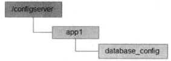
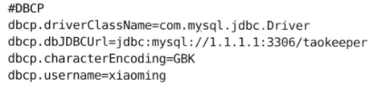

# 第六章 ZooKeeper的应用场景

## 数据发布/订阅

​		数据发布/订阅系统，即所谓的配置中心，顾名思义就是发布者将数据发布到ZooKeeper的一个或一系列节点上，供订阅者进行数据订阅，进而达到动态获取数据的目的，实现配置信息的集中式管理和数据的动态更新。

​		发布/订阅系统一般有两种设计模式，分别是推模式和拉模式。在推模式中，服务端主动将数据更新发送到所有订阅的客户端；而拉模式则是有客户端主动发起请求来获取最新数据，通常客户端都采用定时进行轮询拉取的方式。ZooKeeper推拉相结合的方式：客户端向服务器注册自己需要关注的节点，一旦该节点的数据发生变更，那么服务器就会向相应的客户端发送Watcher事件通知，客户端接收到这个消息通知之后，需要主动到服务端获取最新的数据。

​		如果配置信息存放到ZooKeeper上进行集中管理，那么通常情况下，应用在启动的时候都会主动到ZooKeeper服务端上进行一次配置信息的获取，同时，在指定节点上注册一个Watcher监听，这样一来，但凡配置信息发生变更，服务端都会实时通知到所有订阅的客户端，从而达到实时获取最新配置信息的目的。

 		在我们平常的应用系统开发中，经常会碰到这样的需求：系统中需要使用一些通用的配置信息，例如机器列表信息、运行时的开关配置、数据库配置信息等。这些全局配置信息通常具备以下3个特性：

* 数据量小

* 数据内容在运行时会发送动态变化

* 集群中各机器共享，配置一致

对于这类配置信息，一般的做法通常可以选择将其存储在本地配置文件或是内存变量中。

**本地配置文件的方式：**这种方式通常系统可以在应用启动的时候读取本地磁盘的一个文件来进行初始化，并在运行过程中定时地进行文件的读取，以此来检测文件内容的变更。

**内存变量配置的方式：**以Java系统为例，通常可以采用JMX方式来实现对系统运行时内存变量的更新。

**弊端：**

​		通常在机器规模不大、配置变更不是特别频繁的情况下，无论上面提到的那种方式，都能够非常方便地解决配置管理问题。但是，一旦机器规模变大，配置信息变更频繁后，我们发现依靠现有的这两种方式就变得困难了。

ZooKeeper可以很好的实现这种配置管理：

​		我们以“数据库切换”的应用场景为例，看看ZooKeeper如何实现配置管理。

**配置存储**

​	在配置管理之前，首先我们需要将初始化配置存储到ZooKeeper上去。一般情况下，我们可以在ZooKeeper上选取一个数据节点用于配置的存储，例如/app1/database_config

我们将需要集中管理的配置信息写入到该数据节点中去，例如：

 

**配置获取**

​		集群中每台机器在启动初始化阶段，首先会从上面提到的ZooKeeper配置节点上读取数据库配置信息，同时，客户端还需要在该配置节点上注册一个数据变更的Watcher监听，一旦发生节点数据变更，所有订阅的客户端都能够获取到数据变更通知。

**配置变更**

​		在系统运行过程中，可能会出现需要进行数据库切换的情况，这个时候就需要进行配置变更。借助ZooKeeper，我们只需要对ZooKeeper上配置节点的内容进行更新，ZooKeeper就能够帮助我们将数据变更的通知发送到各个客户端，每个客户端在接收到这个变更通知后，就可以重新进行最近数据的获取了。

## Master选举

​		在分布式系统中，Master往往用来协调集群中其他系统单元，具有对分布式系统状态变更的决定权。例如，在一些读写分离的应用场景中，客户端的写请求往往是有Master来处理的；而在另一些场景中，Master则常常负责处理一些复杂的逻辑，并将处理结果同步给集群中其他单元。Master选举可以说是ZooKeeper最典型的应用场景了。

​		下面我们结合“一种海量数据处理与共享模型”这个例子来看看ZooKeeper在集群Master选举中的应用场景：在分布式环境中，经常会碰到这样的应用场景：集群中的所有系统单元需要对前端业务提供数据，比如一个商品ID，或者是一个网站轮播广告的广告ID（通常出现在一些广告投放系统中）等，而这些商品ID或是广告ID往往需要从一系列的海量数据处理中计算得到，这通常是一个非常耗I/O和CPU资源的过程。鉴于该计算过程的复杂性，如果让集群中的所有机器都执行这个计算逻辑的话，那么将耗费非常多的资源。一种比较好的方法就是只让集群中的部分，甚至只让其中的一台机器去处理数据计算，一旦计算出数据结果，就可以共享给整个机器中的其他所有客户端机器，这样可以大大减少重复劳动，提升性能。

​		这里我们以一个简单的广告投放系统后台场景为例来讲解这个模型。整个系统大体上可以分成客户端集群、分布式缓存系统、海量数据处理总线和ZooKeeper四个部分，如下图：

​		首先我们来看看整个系统的运行机制，Client集群每天定时会通过ZooKeeper来实现Master选举。选举产生Master客户端之后，这个Master就会负责进行一系列的海量数据处理，最终计算得到一个数据结果，并将其放置在一个内存/数据库中。同时，Master还需要通知集群中其他所有的客户端从这个内存/数据库中共享计算结果。

​		接下去，我们将重点来看Master选举的过程，首先明确下Master选举的需求：在集群的所有机器中选举出一台机器作为Master。针对这个需求，通常情况下，我们可以选择常见的关系型数据库中的主键特性来实现：集群中的所有机器都向数据库插入一条相同主键ID的记录，数据库会帮助我们自动进行主键冲突检查，也就是说，所有进行插入操作的客户端机器中，只有一台机器能够成功，那么，我们就认为向数据库中成功插入数据的客户端机器称为Master。

​		这个方案确实可行，依靠关系型数据库的主键特性能够很好地保证在集群中选举出唯一的一个Master。但是我们需要考虑的另一个问题是，如果当前选举出的Master挂了，那么该如何处理？谁来告诉我们Master挂了呢？显然，关系型数据库没法通知我们这个事件。而ZooKeeper可以做到这一点。

​		在ZooKeeper创建节点时，有一个重要的特性是：利用ZooKeeper的强一致性，能够很好地保证在分布式高并发情况下节点的创建一定能够保证全局唯一性，即ZooKeeper将会保证客户端无法重复创建一个已经存在的数据节点。也就是说，如果同时有多个客户端请求创建同一个几点，那么最终一定只有一个客户端请求能够创建成功。利用这个特性，就能很容易地在分布式环境中进行Master选举了。

​		如图：一种海量数据处理与共享模型的ZooKeeper节点示意图：

​		客户端集群每天都会定时往ZooKeeper上创建一个临时节点，例如/master_election/2013-09-20/binding。这个过程中，只有一个客户端能够成功创建这个节点，那么这个客户端，都会在节点/master_election/2013-09-20上注册一个子节点变更的Watcher，用于监控当前的Master机器是否还存活，一旦发现当前的Master挂了，那么其余的客户端将会重新进行Master选举。

## 分布式锁

​		分布式锁是控制分布式系统之间同步访问共享资源的一种方式。如果不同的系统或是同一个系统的不同主机之间共享一个或一组资源，那么访问这些资源的时候，往往需要通过一些互斥手段来防止彼此之间的干扰，以保证一致性，在这种情况下，就需要使用分布式锁了。

​		在平时的实际项目开发中，我们往往很少会去在意分布式锁，而是依赖于关系型数据库固有的排他性来实现不同进程之间的互斥。这确实是一种非常简便且被广泛使用的分布式锁实现方式。然而有一个不争的事实是，目前绝大多数大型分布式系统的性能瓶颈都集中在数据操作上。因此，如果上层业务再给数据库添加一些额外的锁，例如行锁、表锁甚至是繁重的事务处理，那么会数据更加不堪重负。

​		下面我们来看看使用ZooKeeper如何实现分布式锁，这里主要讲解排他锁和共享锁两类分布式锁。

### 排他锁（写锁或独占锁）

​		如果事务T1对数据对象O1加上了排他锁，那么整个加锁期间，只允许事务T1对O1进行读取和更新操作，其他任何事务都不能再对这个数据对象进行任何类型的操作，直到T1释放了排他锁。

​		排他锁的核心是如何保证当前有且仅有一个事务获得锁，并且锁被释放后，所有正在等待获取锁的事务都能够被通知到。

**定义一个锁**

​		在通常的Java开发编程中，有两种常见的方式可以用来定义锁，分别是synchronized机制和JDK5提供的ReentrantLock。然而在ZooKeeper中是通过ZooKeeper上的数据节点来表示一个锁，例如/exclusive_lock节点就可以被定义为一个锁，如下图：

**获取锁**

​		在需要获取排他锁时，所有的客户端都会视图通过调用create()接口，在/exclusive_lock节点下创建临时子节点，ZooKeeper可以保证在所有的客户端中，最终只有一个客户端能够创建成功，那么就可以认为该客户端获取了锁。同时没有获取到锁的客户端会在/exclusive_lock节点上注册一个子节点变更的Watcher监听，以便实时监听到lock节点的变更情况。

**释放锁**

释放锁有两种情况：

* 当前获取锁的客户端机器发生宕机，那么ZooKeeper上的这个临时节点就会被移除；

* 正常执行完业务逻辑后，客户端就会主动将自己创建的临时节点删除

​		无论在什么情况下移除了lock节点，ZooKeeper都会通知所有在/exclusive_lock节点上注册了子节点变更Watcher监听的客户端。这些客户端在接收到通知后，再次重新发起分布式锁获取，即重复“获取锁”的过程。整个排他锁的获取和释放流程如下：

### 共享锁（读锁）

​		如果事务T1对数据对象O1加上了共享锁，那么当前事务只能对O1进行读取操作，其他事务也只能对这个数据对象加共享锁，直到该数据对象上的所有共享锁都被释放。

​		共享锁和排他锁的区别在于，排他锁的数据对象只对一个事务可见，而共享锁的数据对所有事务都可见。

 

**定义锁**

​	和排他锁一样，同样是通过ZooKeeper上的数据节点来表示一个锁，如下图：

 

**获取锁**

​	在需要获取共享锁时，所有客户端都会到/shared_lock这个节点下面创建一个临时顺序节点；

​	如果当前是读请求，那么就创建例如/shared_lock/193.168.0.1-R-0000000001节点；

​	如果是写请求，那么就创建例如例如/shared_lock/193.168.0.1-W-0000000001的节点。

**判断读写顺序**

​		根据共享锁的定义，不同的事务都可以同时对同一个数据对象进行读操作，而更新操作必须在当前没有任何事务进行读操作的情况下进行，基于这个原则，ZooKeeper分布式读写顺序大致可以分为如下4个步骤：

1、获取/shared_lock节点下的所有子节点，并对该节点注册子节点变更的Watcher监听。

2、确定自己的节点序号在所有子节点中的顺序

3、 对于读请求：如果没有比自己序号小的子节点，或是所有比自己序号小的子节点都是读请求，那么表明自己已经成功获取到共享锁，同时开始执行读取逻辑。如果比自己序号小的子节点中有写请求，那么就需要进入等待。

对于写请求：如果自己不是序号最小的子节点，那么就需要进入等待。

4、接收到Watcher通知后，重复步骤1

 

**释放锁**

​	释放锁的逻辑和排他锁是一致的，这里不再赘述。

## 分布式队列

​		业界有不少分布式队列产品，比如ActiveMQ、Kafka和HornetQ等消息中间件（或称为消息队列）。ZooKeeper也能实现分布式队列。分布式队列可以分为两大类：一种常规的先入先出队列，另一种是等到队列元素集聚之后才同意安排执行的Battier模型。

### FIFO：先入先出

​	ZooKeeper实现FIFO队列和使用ZooKeeper实现共享锁的实现非常类似。FIFO队列就类似于一个全写的共享锁模型，大体的设计思路是：所有客户端都会到/queue_fifo这个节点下面创建一个临时顺序节点，如下图：

​	创建完节点之后，根据如下4个步骤来确定执行顺序：

1、通过getChildren()接口来获取/queue_fifo节点下的所有子节点，即获取队列中所有的元素；

2、确定自己的节点序号在所有子节点中的顺序；

3、如果自己不是序号最小的子节点，那么就需要进入等待，同时向比自己序号小的最后一个节点注册Watcher监听。

4、接收到Watcher通知后，重复步骤1.

整个FIFO队列的工作流程如下：

 

### Barrier：分布式屏障

​		Barrier原意是指障碍物、屏障，而在分布式系统中，特指系统之间的一个协调条件，规定了一个队列的元素必须都集聚后才能统一进行安排，否则一直等待。这往往出现在那些大规模分布式并行计算的应用场景上：最终的合并计算需要基于跟多并行计算的子结果来进行。

​		大致的设计思想如下：开始时，/queue_barrier节点是一个已经存在的默认节点，并且将其节点的数据内容赋值为一个数字n来代表Barrier值，例如n=10，表示只有当/queue_barrier节点下的子节点个数达到10后，才会执行操作。所有的客户端都会到/queue_barrier节点下创建一个临时节点，如下图：

 

创建完节点之后，根据如下5个步骤来确定执行顺序：

1、通过调用getData()接口获取/queue_barrier节点的数据内容：10；

2、通过调用getChildren()接口获取/queue_barrier节点下的所有子节点，即获取队列中的所有元素，同时注册对子节点列表变更的Watcher监听

3、统计子节点的个数

4、如果子节点个数还不足10个，那么需要进入等待

5、接收到Watcher通知后，重复步骤2

整个Barrier队列的工作流程，如下图：

 

